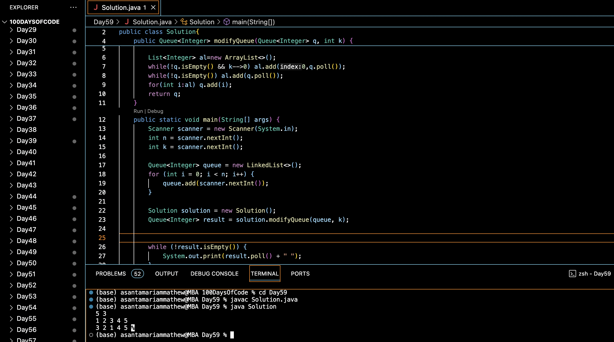

# REVERSE FIRST K ELEMENTS OF QUEUE :blush:
## DAY :five: :nine: -January 12, 2024

## Code Overview
This Java program modifies a queue by reversing the first `k` elements. It takes a queue of integers `q` and an integer `k` as input, reverses the order of the first `k` elements in the queue, and returns the modified queue.

## Key Features
- Efficiently modifies a queue by reversing the first `k` elements.
- Utilizes a list to temporarily store the reversed elements before adding them back to the queue.
- Handles both positive and negative integers in the queue.

## Code Breakdown
The program consists of:
1. `modifyQueue` method: This method takes a queue `q` and an integer `k` as input. It reverses the order of the first `k` elements in the queue and returns the modified queue.
    - It initializes a list `al` to temporarily store the reversed elements.
    - It iterates through the first `k` elements of the queue, removes them from the queue, and adds them to the beginning of the list.
    - It then iterates through the remaining elements of the queue, removes them from the queue, and adds them to the end of the list.
    - Finally, it adds all elements from the list back to the queue and returns the modified queue.

2. `main` method: The main entry point of the program. It reads input from the user to initialize the queue and the integer `k`, calls the `modifyQueue` method, and prints the modified queue.

## Usage
To use this program:
1. Compile the Java file.
2. Run the compiled Java class.
3. Input the number of elements in the queue `n` and the number of elements to reverse `k`.
4. Input the elements of the queue.
5. The program will output the modified queue after reversing the first `k` elements.

## Output

## Link
<https://auth.geeksforgeeks.org/user/asantamarptz2>
