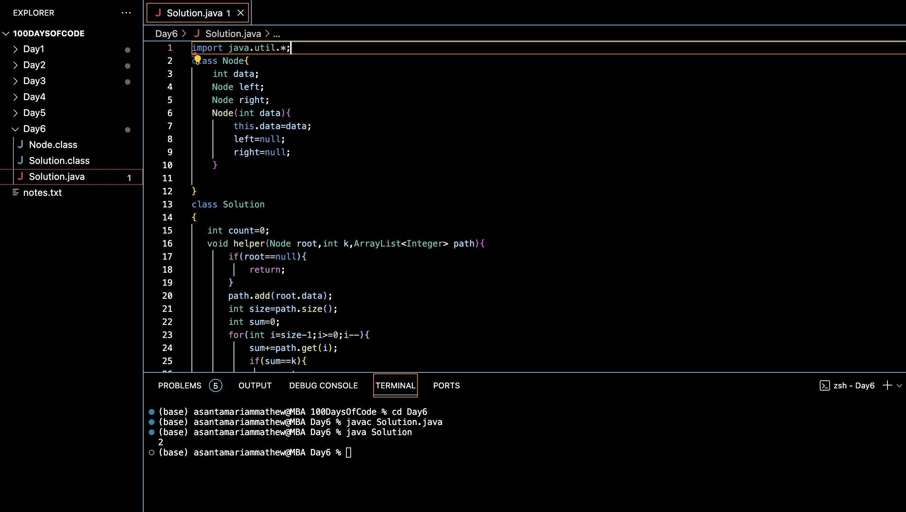

# K SUM PATHS:blush:
## DAY :six: -November 20, 2023

## Code Overview
The provided code offers a Java solution to count the number of paths in a binary tree that sum up to a given value k. It defines a Node class representing a node in the binary tree and a Solution class containing the logic to perform the path sum counting.

## Key Features
**Path Sum Counting**: The code efficiently traverses the binary tree to count the number of paths whose sum matches the given value k.

**Backtracking Technique**: It utilizes backtracking to explore all possible paths from the root to leaf nodes while maintaining the current path and sum.

## Code Breakdown
**Node Class**: 

Represents a node in the binary tree, storing integer data and references to left and right child nodes.

**Solution Class**:

-helper(Node root, int k, ArrayList<Integer> path): Recursively traverses the binary tree, updating the current path and sum, and counting the paths with sum equal to k.

-sumK(Node root, int k): Initializes the traversal by calling the helper method and returns the count of paths with sum equal to k.

-main(String[] args): Demonstrates the usage of the sumK method by creating a sample binary tree, specifying the target sum k, and printing the result.

## Usage
1. Ensure you have a Java development environment configured.
2. Copy the Node and Solution classes into your project.
3. Create a binary tree by initializing nodes and setting their left and right child pointers accordingly.
4. Call the sumK method from the Solution class, passing the root of the binary tree and the target sum k as arguments.
5. Obtain the count of paths with sum equal to k and perform necessary operations.

## Output

## Link
<https://auth.geeksforgeeks.org/user/asantamarptz2>

