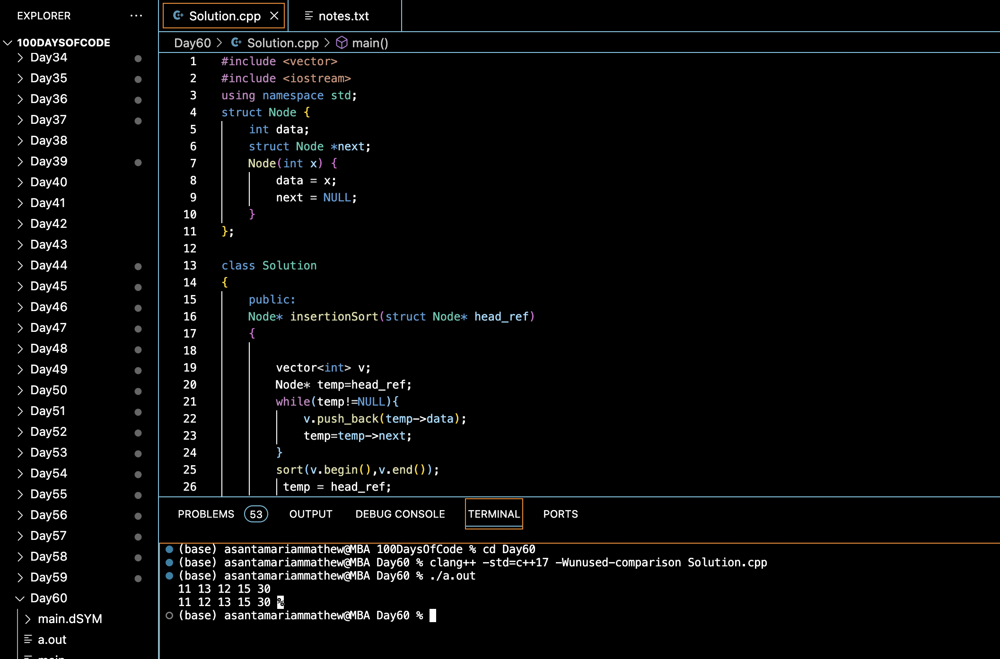

# INSERTION SORT FOR SINGLY LINKED LIST :blush:
## DAY :six: :zero: -January 13, 2024

## Code Overview
This C++ program implements the insertion sort algorithm to sort a singly linked list. The program takes a linked list as input, sorts it in non-decreasing order based on the values of its nodes, and returns the sorted linked list.

## Key Features
- Efficiently sorts a linked list using the insertion sort algorithm.
- Utilizes a vector to temporarily store the values of the linked list nodes for sorting.
- Handles both positive and negative integers in the linked list.

## Code Breakdown
The program consists of:
1. **Node Structure**: Defines a structure for a linked list node, containing an integer `data` and a pointer `next` to the next node.
2. **`insertionSort` Method**: Sorts the linked list using the insertion sort algorithm.
    - Initializes a vector `v` to store the values of the linked list nodes.
    - Iterates through the linked list and pushes the values of each node into the vector.
    - Sorts the vector in non-decreasing order.
    - Updates the data values of the linked list nodes with the sorted values from the vector.
    - Returns the head of the sorted linked list.
3. **`main` Function**: The main entry point of the program.
    - Reads the number of nodes `N` in the linked list and initializes the head node with the first value.
    - Reads the data values for the remaining nodes and creates the linked list accordingly.
    - Calls the `insertionSort` method to sort the linked list.
    - Prints the data values of the sorted linked list.

## Usage

1. Compile the C++ file using a C++ compiler.
2. Run the compiled program.
3. Input the number of nodes `N` in the linked list.
4. Input the data values for each node of the linked list.
5. The program will output the sorted linked list in non-decreasing order.

## Output

## Link
<https://auth.geeksforgeeks.org/user/asantamarptz2>