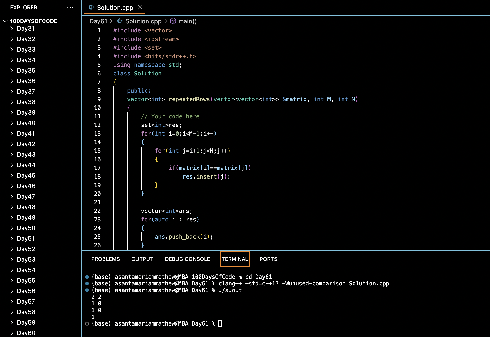

# FIND DUPLICATE ROWS IN A BINARY MATRIX :blush:
## DAY :six: :one: -January 14, 2024

## Code Overview

This code is designed to identify and return the indices of rows in a matrix that are duplicates of other rows. It defines a `Solution` class with a method `repeatedRows` to find such duplicate rows and returns their indices. The main function prompts the user to input the size of the matrix and its elements, then it utilizes the `repeatedRows` method to find and display the indices of the duplicate rows.

## Key Features

- Identifies duplicate rows in a matrix.
- Utilizes sets to efficiently store indices of duplicate rows.
- Simple and easy-to-understand implementation.
- Command-line interface for input and output.

## Code Breakdown

- **Solution Class**: 
  - Defines a class `Solution` with a method `repeatedRows`.
  - `repeatedRows` takes a 2D vector representing the matrix and its dimensions as input and returns a vector containing the indices of duplicate rows.
- **Main Function**:
  - Reads the dimensions of the matrix (number of rows and columns) from the user.
  - Reads the elements of the matrix from the user.
  - Creates an object of the `Solution` class, calls the `repeatedRows` method, and displays the indices of the duplicate rows.

## Usage

1. Compile the code using a C++ compiler.
2. Execute the compiled binary.
3. Enter the number of rows and columns for the matrix.
4. Input the elements of the matrix row by row.
5. The program will output the indices of the duplicate rows, if any.

## Output

## Link
<https://auth.geeksforgeeks.org/user/asantamarptz2>