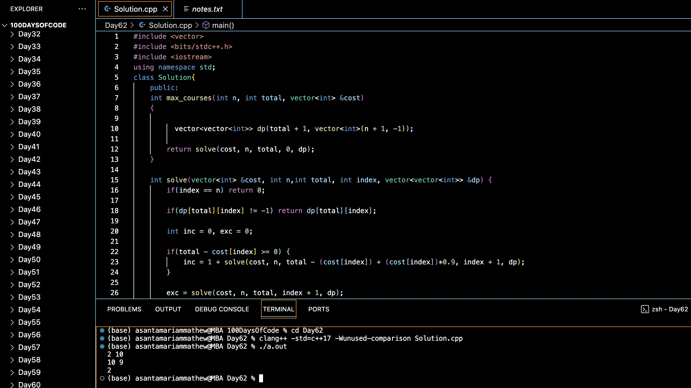

# GRINDING GEEK :blush:
## DAY :six: :two: -January 15, 2024

## Code Overview

This code calculates the maximum number of courses that can be taken within a given budget, considering a discount for each course. It defines a `Solution` class with a method `max_courses` to compute the maximum number of courses. The `max_courses` method uses dynamic programming to efficiently solve the problem by considering all possible combinations of courses within the budget.

## Key Features

- Efficiently computes the maximum number of courses within a given budget.
- Utilizes dynamic programming to optimize computation.
- Provides a simple interface for input and output.
- Handles integer costs and budgets.

## Code Breakdown

- **Solution Class**: 
  - Defines a class `Solution` with a method `max_courses`.
  - `max_courses` takes the number of courses, total budget, and vector of course costs as input and returns the maximum number of courses that can be taken within the budget.
- **solve Function**:
  - Helper function for dynamic programming.
  - Considers two cases for each course: including the course in the selection and excluding the course.
  - Updates the dynamic programming table with the maximum number of courses for each budget and course index.
- **Main Function**:
  - Reads the number of courses (`n`) and total budget (`total`) from the user.
  - Reads the cost of each course from the user.
  - Creates an object of the `Solution` class, calls the `max_courses` method, and displays the result.

## Usage

1. Compile the code using a C++ compiler.
2. Execute the compiled binary.
3. Enter the number of courses (`n`) and the total budget (`total`).
4. Input the cost of each course one by one.
5. The program will output the maximum number of courses that can be taken within the budget.

## Output

## Link
<https://auth.geeksforgeeks.org/user/asantamarptz2>