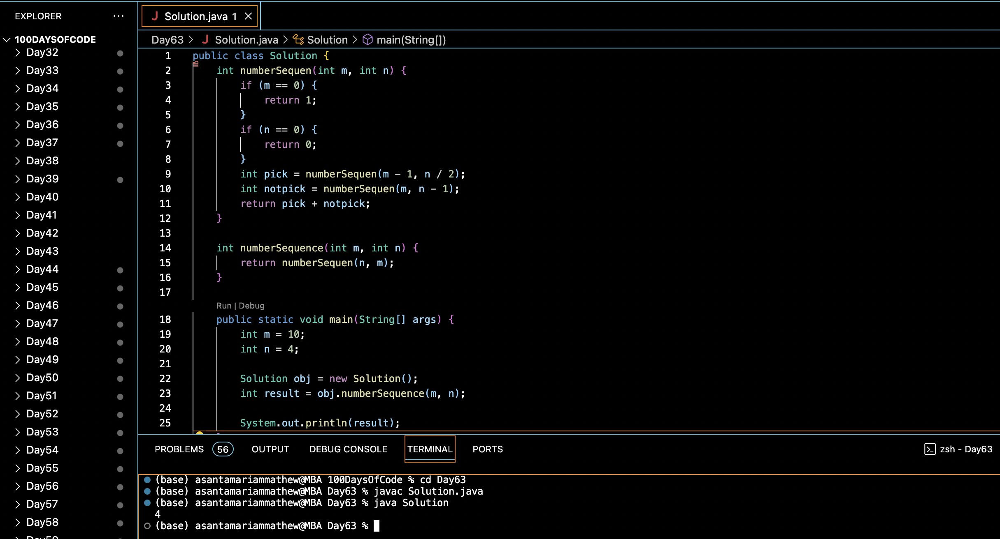

# SEQUENCE OF SEQUENCE :blush:
## DAY :six: :three: -January 16, 2024

## Code Overview

This Java code computes the number of sequences that can be formed using two operations: picking a number and not picking a number. It defines a `Solution` class with methods `numberSequen` and `numberSequence` to calculate the number of sequences based on given parameters `m` and `n`. The `numberSequen` method recursively computes the number of sequences, and the `numberSequence` method serves as a wrapper function for calling `numberSequen` with parameters swapped. The main function demonstrates the usage of these methods by providing input values `m` and `n` and outputting the result.

## Key Features

- Computes the number of sequences based on recursive calculations.
- Supports integer inputs for `m` and `n`.
- Provides a simple interface for input and output.

## Code Breakdown

- **Solution Class**: 
  - Defines a class `Solution` with methods `numberSequen` and `numberSequence`.
  - `numberSequen` recursively calculates the number of sequences based on given parameters `m` and `n`.
  - `numberSequence` acts as a wrapper function for calling `numberSequen` with parameters swapped.
- **Main Function**:
  - Takes input values `m` and `n`.
  - Creates an object of the `Solution` class, calls the `numberSequence` method, and prints the result.

## Usage

1. Compile the Java code.
2. Run the compiled bytecode.
3. Enter the values for `m` and `n` when prompted.
4. The program will output the number of sequences that can be formed using the provided values of `m` and `n`.

## Output

## Link
<https://auth.geeksforgeeks.org/user/asantamarptz2>
