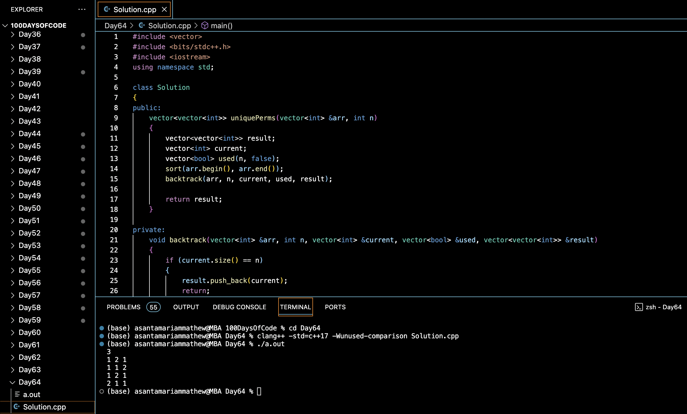

# ALL UNIQUE PERMUTATIONS OF AN ARRAY :blush:
## DAY :six: :four: -January 17, 2024

## Code Overview

This C++ code generates all unique permutations of a given array of integers. It defines a `Solution` class with a method `uniquePerms` to compute unique permutations using backtracking. The `uniquePerms` method takes a vector of integers and its size as input and returns a vector of vectors representing all unique permutations of the input array. The main function prompts the user to input the size of the array and its elements, then it calculates and outputs the unique permutations of the array elements.

## Key Features

- Computes unique permutations of a given array.
- Utilizes backtracking algorithm to generate permutations efficiently.
- Handles integer inputs for array size and elements.
- Provides a simple interface for input and output.

## Code Breakdown

- **Solution Class**: 
  - Defines a class `Solution` with a method `uniquePerms`.
  - `uniquePerms` generates all unique permutations of the given array using backtracking.
- **backtrack Function**:
  - Helper function for generating permutations recursively.
  - Avoids generating duplicate permutations by skipping repeated elements.
- **Main Function**:
  - Reads the size of the array (`n`) from the user.
  - Reads the elements of the array from the user.
  - Creates an object of the `Solution` class, calls the `uniquePerms` method, and prints the generated permutations.

## Usage

1. Compile the C++ code.
2. Run the compiled executable.
3. Enter the size of the array when prompted.
4. Enter the elements of the array one by one.
5. The program will output all unique permutations of the array elements.

## Output

## Link
<https://auth.geeksforgeeks.org/user/asantamarptz2>
