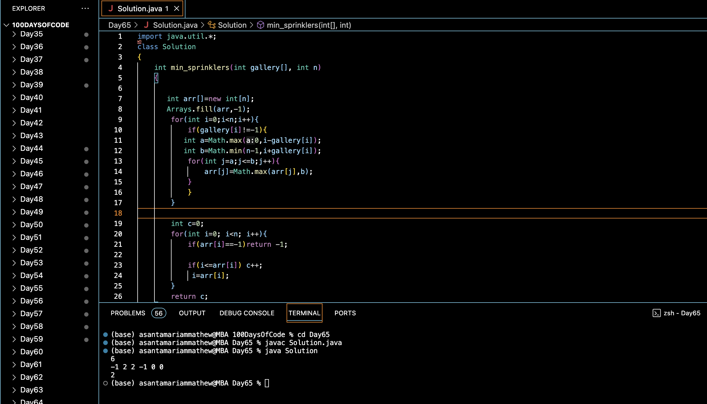

# WATER THE PLANTS :blush:
## DAY :six: :five: -January 18, 2024

## Code Overview

This Java code calculates the minimum number of sprinklers required to water a gallery based on the given configuration of sprinklers and gallery layout. The `Solution` class contains a method `min_sprinklers` that takes an array representing the gallery layout and its size as input and returns the minimum number of sprinklers needed. The main function prompts the user to input the gallery layout and then calculates and outputs the result.

## Key Features

- Calculates the minimum number of sprinklers needed to water the gallery.
- Utilizes arrays and loops for efficient computation.
- Handles integer inputs for gallery layout and size.
- Provides a simple interface for input and output.

## Code Breakdown

- **Solution Class**: 
  - Defines a class `Solution` with a method `min_sprinklers`.
  - `min_sprinklers` calculates the minimum number of sprinklers needed based on the given gallery layout and configuration.
- **Main Function**:
  - Reads the size of the gallery layout (`n`) from the user.
  - Reads the elements of the gallery layout from the user.
  - Creates an object of the `Solution` class, calls the `min_sprinklers` method, and prints the calculated result.

## Usage

1. Compile the Java code.
2. Run the compiled bytecode.
3. Enter the number of elements in the gallery layout when prompted.
4. Enter the elements of the gallery layout one by one.
5. The program will output the minimum number of sprinklers needed to water the gallery according to the provided configuration.

## Output

## Link
<https://auth.geeksforgeeks.org/user/asantamarptz2>
