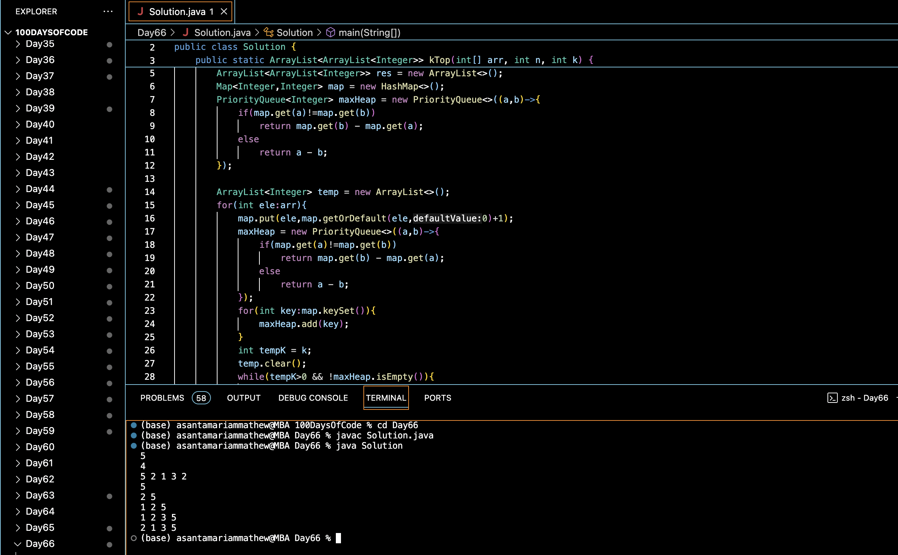

# TOP K NUMBERS IN A STREAM :blush:
## DAY :six: :six: -January 19, 2024

## Code Overview

This Java code calculates the top K elements for each prefix of a given array. It defines a `Solution` class with a method `kTop` that takes an array of integers, its size, and the value of K as input and returns a list of lists representing the top K elements for each prefix of the array. The main function prompts the user to input the size of the array, the value of K, and the elements of the array. Then, it calculates and outputs the top K elements for each prefix of the array.

## Key Features

- Computes the top K elements for each prefix of a given array.
- Utilizes a priority queue and a map for efficient computation.
- Handles integer inputs for array size, K value, and array elements.
- Provides a simple interface for input and output.

## Code Breakdown

- **Solution Class**: 
  - Defines a class `Solution` with a method `kTop`.
  - `kTop` calculates the top K elements for each prefix of the given array using a priority queue and a map.
- **Main Function**:
  - Reads the size of the array (`N`) from the user.
  - Reads the value of K (`K`) from the user.
  - Reads the elements of the array from the user.
  - Creates an object of the `Solution` class, calls the `kTop` method, and prints the calculated top K elements for each prefix of the array.

## Usage

1. Compile the Java code.
2. Run the compiled bytecode.
3. Enter the number of elements in the array when prompted.
4. Enter the value of K when prompted.
5. Enter the elements of the array one by one.
6. The program will output the top K elements for each prefix of the array according to the provided configuration.

## Output

## Link
<https://auth.geeksforgeeks.org/user/asantamarptz2>
