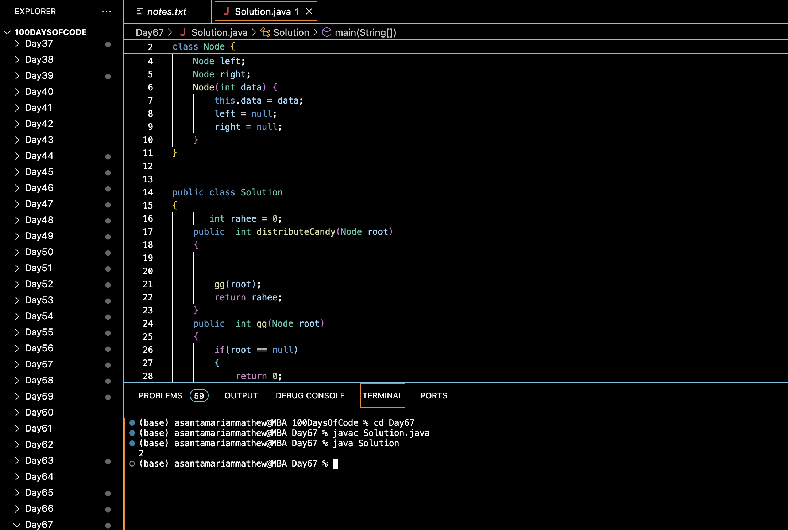

# DISTRIBUTE CANDIES IN A BINARY TREE :blush:
## DAY :six: :seven: -January 20, 2024

## Code Overview

This Java code defines a binary tree node class `Node` and a `Solution` class with methods to distribute candy among the nodes of the tree. The `distributeCandy` method calculates the minimum number of candies required to distribute among the nodes such that each node receives at least one candy. The `gg` method is a helper method that recursively computes the number of candies needed for each node and updates the total number of candies required. The `main` function creates a sample binary tree, calculates the minimum number of candies required, and outputs the result.

## Key Features

- Computes the minimum number of candies required to distribute among the nodes of a binary tree.
- Utilizes recursion to traverse the tree and calculate the number of candies for each node.
- Updates a global variable to keep track of the total number of candies required.
- Handles integer inputs for node values and provides a simple interface for input and output.

## Code Breakdown

- **Node Class**: 
  - Defines a class `Node` representing a binary tree node with integer data, left, and right child nodes.
- **Solution Class**: 
  - Defines a class `Solution` with methods to distribute candy among nodes (`distributeCandy`) and a helper method for recursion (`gg`).
  - `distributeCandy` calculates the minimum number of candies required by calling the helper method `gg` and returns the result.
  - `gg` recursively computes the number of candies needed for each node and updates the total number of candies required.
- **Main Function**:
  - Creates a sample binary tree with nodes containing integer values.
  - Creates an object of the `Solution` class, calls the `distributeCandy` method, and prints the calculated result.

## Usage

1. Compile the Java code.
2. Run the compiled bytecode.
3. The program will output the minimum number of candies required to distribute among the nodes of the binary tree.

## Output

## Link
<https://auth.geeksforgeeks.org/user/asantamarptz2>
