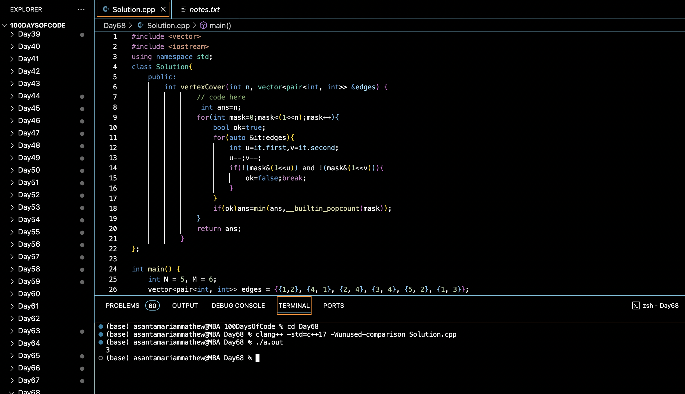

# VERTEX COVER :blush:
## DAY :six: :eight: -January 21, 2024

## Code Overview

This C++ code calculates the minimum number of vertices required to cover all edges in a given graph. It defines a `Solution` class with a method `vertexCover` that takes the number of vertices (`n`) and a vector of edges (`edges`) as input and returns the minimum number of vertices needed to cover all edges. The `main` function initializes the input parameters, calls the `vertexCover` method, and prints the result.

## Key Features

- Computes the minimum number of vertices needed to cover all edges in a graph.
- Utilizes bitwise operations to iterate over all possible vertex cover configurations.
- Checks whether each configuration covers all edges of the graph.
- Returns the minimum number of vertices needed among all valid configurations.
- Provides a simple interface for input and output.

## Code Breakdown

- **Solution Class**: 
  - Defines a class `Solution` with a method `vertexCover`.
  - `vertexCover` iterates over all possible configurations of vertices and checks if each configuration covers all edges.
  - Returns the minimum number of vertices needed to cover all edges.
- **Main Function**:
  - Initializes the number of vertices (`N`) and edges (`M`) of the graph.
  - Creates a vector of pairs representing the edges of the graph.
  - Creates an object of the `Solution` class, calls the `vertexCover` method, and prints the calculated result.

## Usage

1. Compile the C++ code.
2. Run the compiled executable.
3. The program will output the minimum number of vertices required to cover all edges of the graph.

## Output

## Link
<https://auth.geeksforgeeks.org/user/asantamarptz2>
