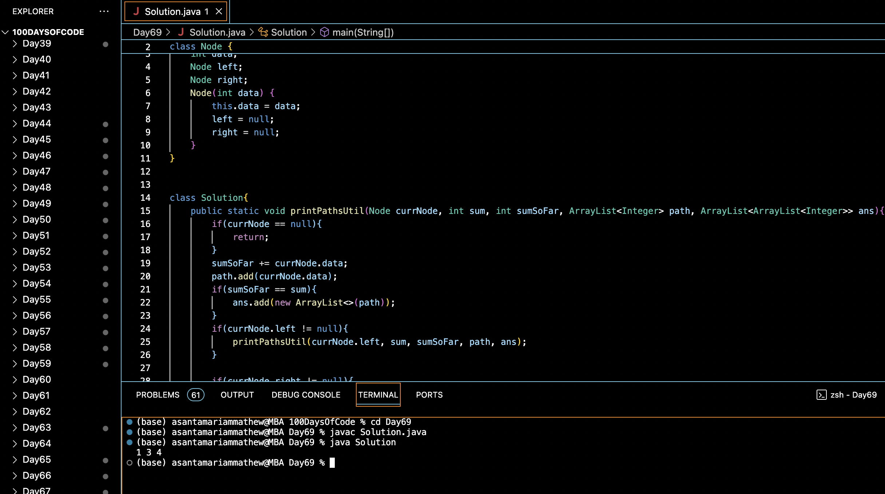

# PATHS FROM ROOT WITH SPECIFIED SUM :blush:
## DAY :six: :nine: -January 22, 2024

## Code Overview

This Java code defines a binary tree node class `Node` and a `Solution` class with methods to find all paths in the tree that sum up to a given value. The `printPaths` method calculates all possible paths in the binary tree whose nodes sum up to the given value. The `main` function initializes a sample binary tree, calls the `printPaths` method, and prints the resulting paths that sum up to the given value.

## Key Features

- Computes all paths in a binary tree that sum up to a given value.
- Utilizes recursion to traverse the binary tree and calculate the sum of paths.
- Stores the paths that meet the criteria in an ArrayList of ArrayLists for further processing.
- Provides a simple interface for input and output.

## Code Breakdown

- **Node Class**: 
  - Defines a class `Node` representing a node in a binary tree with integer data, left, and right child nodes.
- **Solution Class**: 
  - Defines a class `Solution` with methods to find paths in the binary tree that sum up to a given value (`printPaths` and `printPathsUtil`).
  - `printPaths` initializes an empty path list and calls `printPathsUtil` to find all paths that sum up to the given value.
  - `printPathsUtil` is a recursive function that traverses the binary tree and calculates the sum of paths, storing the valid paths in an ArrayList of ArrayLists.
- **Main Function**:
  - Initializes the sum and constructs a sample binary tree with integer values.
  - Calls the `printPaths` method to find all paths that sum up to the given value.
  - Prints the resulting paths.

## Usage

1. Compile the Java code.
2. Run the compiled bytecode.
3. The program will output the paths in the binary tree that sum up to the given value.

## Output

## Link
<https://auth.geeksforgeeks.org/user/asantamarptz2>
