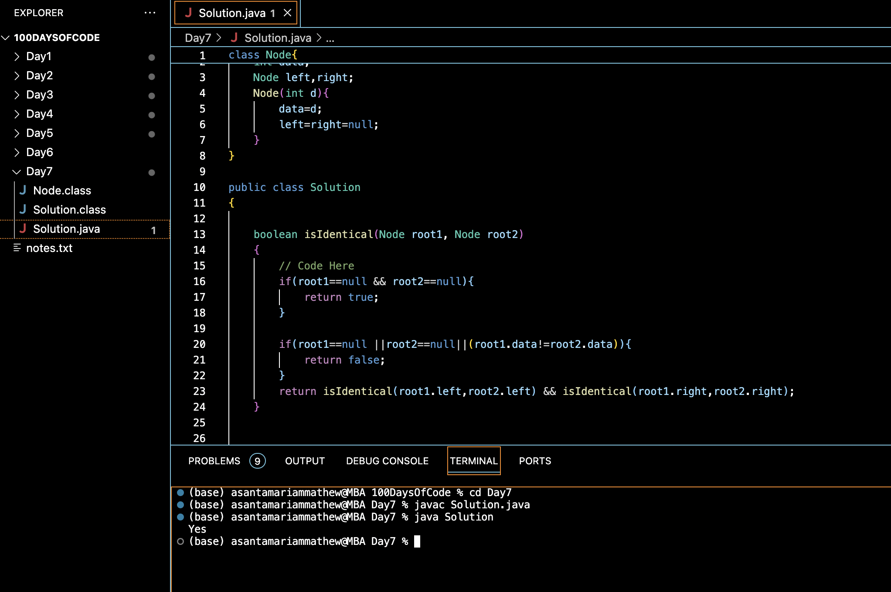

# DETERMINE IF TWO TREES ARE IDENTICAL:blush:
## DAY :seven: -November 21, 2023

## Code Overview
This code implements a solution to check if two binary trees are identical. It defines a Node class to represent the structure of a binary tree node and a Solution class containing a method isIdentical to perform the comparison. The main method is provided to demonstrate the usage of the isIdentical method with sample input trees.

## Key Features
**Binary Tree**: The code involves the concept of a binary tree, a hierarchical data structure where each node has at most two children, referred to as the left child and the right child.

**Recursion**: Recursive methods are used to traverse and compare the nodes of the binary trees. The isIdentical method recursively checks if corresponding nodes in both trees are identical.

**Node Representation**: The Node class represents a single node in a binary tree. It encapsulates an integer data value and references to its left and right child nodes.

**Tree Comparison**: The code compares two binary trees for structural and data equality. It examines whether the arrangement of nodes and their data values are identical in both trees.

## Code Breakdown
**Node Class**:

-int data: Represents the integer data stored in the node.
Node left, right: References to the left and right child nodes.

-Node(int d): Constructor initializing the node with data d and setting left and right references to null.

**Solution Class**:

-isIdentical(Node root1, Node root2): Recursively compares two binary trees. Returns true if both trees are identical in structure and data, otherwise returns false.

-main(String[] args): Creates two binary trees, calls isIdentical method to check if they are identical, and prints the result.

## Usage
1. Define your binary trees by creating instances of Node and connecting them appropriately.
2. Create an instance of Solution.
3. Call the isIdentical method with the root nodes of the two trees as arguments.
4. Print the result obtained.

## Output

## Link
<https://auth.geeksforgeeks.org/user/asantamarptz2>