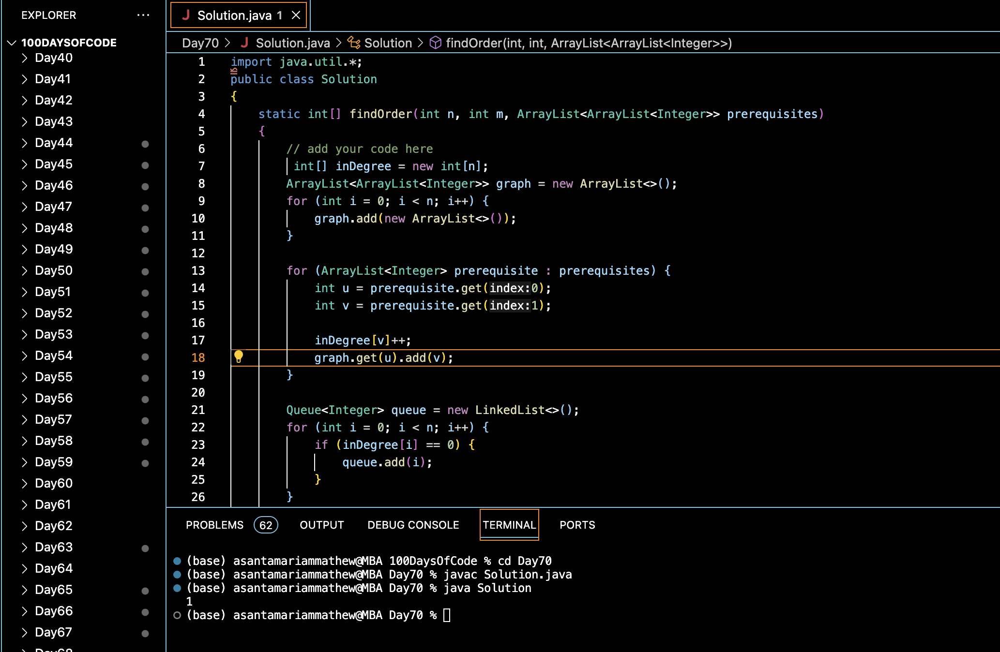

# COURSE SCHEDULE :blush:
## DAY :seven: :zero: -January 23, 2024

## Code Overview

This Java code defines a `Solution` class with a method `findOrder` to determine the topological sorting order of a directed graph given the number of vertices (`n`), the number of edges (`m`), and a list of prerequisites represented as an ArrayList of ArrayLists. The method returns an array representing the topological sorting order if it exists; otherwise, it returns an empty array.

## Key Features

- Computes the topological sorting order of a directed graph.
- Constructs the graph using an ArrayList of ArrayLists to represent adjacency lists.
- Utilizes in-degree array to keep track of incoming edges for each vertex.
- Implements a queue-based approach for topological sorting.
- Provides a simple interface for input and output.

## Code Breakdown

- **Solution Class**: 
  - Defines a class `Solution` with a method `findOrder`.
  - `findOrder` constructs the graph, calculates the in-degree of each vertex, and performs topological sorting using a queue.
  - It returns the topological sorting order if it exists; otherwise, it returns an empty array.
- **Main Function**:
  - Initializes the input parameters (number of vertices, number of edges, and prerequisites) in the `main` method.
  - Constructs the prerequisites ArrayList and calls the `findOrder` method to compute the topological sorting order.
  - Prints the resulting topological sorting order.

## Usage

1. Compile the Java code.
2. Run the compiled bytecode.
3. The program will output the topological sorting order of the directed graph based on the provided prerequisites.

## Output

## Link
<https://auth.geeksforgeeks.org/user/asantamarptz2>