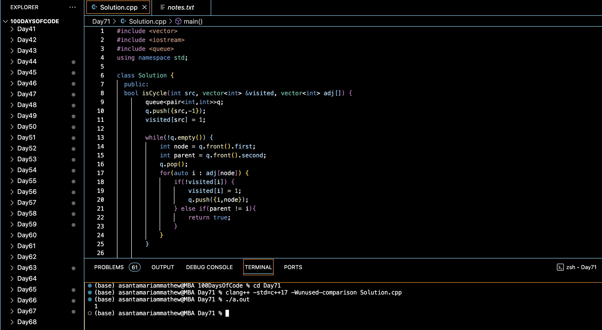

# CHECK IF A GIVEN GRAPH IS TREE OR NOT :blush:
## DAY :seven: :one: -January 24, 2024

## Code Overview

This C++ code defines a `Solution` class with methods to detect whether a given graph is a tree or not. The `isTree` method checks if a graph with `n` vertices and `m` edges is a tree. It constructs an adjacency list representation of the graph and performs cycle detection using BFS traversal. If the graph is connected and acyclic, it returns 1 (indicating a tree); otherwise, it returns 0.

## Key Features

- Determines whether a graph is a tree or not.
- Utilizes BFS traversal for cycle detection.
- Constructs an adjacency list to represent the graph.
- Provides a clear interface for input and output.

## Code Breakdown

- **Solution Class**: 
  - Defines a class `Solution` with a method `isCycle` for cycle detection using BFS traversal.
  - Implements the `isTree` method to check whether the given graph is a tree.
- **Main Function**:
  - Parses the input parameters (number of vertices, number of edges, and the graph) in the `main` function.
  - Constructs the graph using an adjacency list representation.
  - Calls the `isTree` method to determine whether the graph is a tree or not.
  - Prints the result indicating whether the graph is a tree or not.

## Usage

1. Compile the C++ code.
2. Run the compiled executable.
3. Input the number of vertices, number of edges, and the graph as specified in the prompt.
4. The program will output 1 if the graph is a tree; otherwise, it will output 0.

## Output

## Link
<https://auth.geeksforgeeks.org/user/asantamarptz2>
