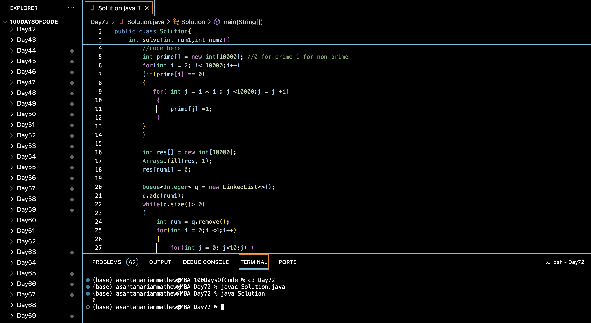

# SHORTEST PRIME PATH :blush:
## DAY :seven: :two: -January 25, 2024

## Code Overview

This Java code defines a `Solution` class with a method `solve` to find the shortest path from one prime number to another by changing one digit at a time. It utilizes the Sieve of Eratosthenes algorithm to generate primes up to a given limit and performs a breadth-first search (BFS) to find the shortest path.

## Key Features

- Implements the Sieve of Eratosthenes algorithm to generate prime numbers.
- Utilizes BFS to find the shortest path between two prime numbers by changing one digit at a time.
- Provides a clear interface for input and output.

## Code Breakdown

- **Solution Class**: 
  - Defines a class `Solution` with a method `solve` to find the shortest path between two prime numbers.
  - Implements the Sieve of Eratosthenes algorithm to generate prime numbers up to 10000.
  - Performs BFS to find the shortest path between the given prime numbers by changing one digit at a time.

- **Main Function**:
  - Initializes two prime numbers `num1` and `num2` in the `main` function.
  - Creates an instance of the `Solution` class.
  - Calls the `solve` method to find the shortest path between `num1` and `num2`.
  - Prints the shortest path length.

## Usage

1. Compile the Java code.
2. Run the compiled Java program.
3. The program will output the shortest path length between the given prime numbers `num1` and `num2`.

## Output

## Link
<https://auth.geeksforgeeks.org/user/asantamarptz2>