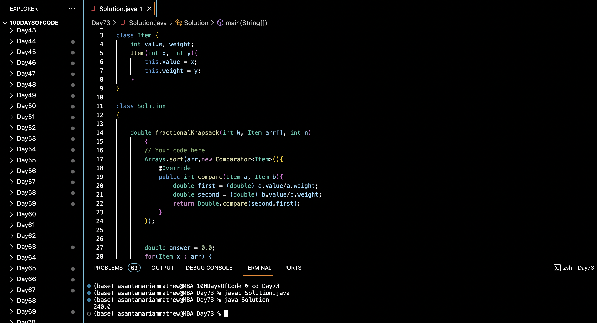

# FRACTIONAL KNAPSACK :blush:
## DAY :seven: :three: -January 26, 2024

## Code Overview

This Java code implements the Fractional Knapsack problem using a greedy approach. It sorts the items based on their value-to-weight ratio and fills the knapsack fractionally to maximize the total value.

## Key Features

- Implements the Fractional Knapsack problem using a greedy algorithm.
- Utilizes the `Item` class to represent items with their value and weight.
- Provides a clear interface for input and output.

## Code Breakdown

- **Item Class**: 
  - Defines a class `Item` with attributes `value` and `weight` to represent individual items.

- **Solution Class**: 
  - Defines a class `Solution` with a method `fractionalKnapsack` to solve the Fractional Knapsack problem.
  - Sorts the items based on their value-to-weight ratio in non-increasing order using a custom comparator.
  - Iterates through the sorted items and fills the knapsack fractionally to maximize the total value.

- **Main Function**:
  - Initializes the number of items `N`, the total weight capacity `W`, and arrays for values and weights of items in the `main` function.
  - Creates an array of `Item` objects based on the provided values and weights.
  - Creates an instance of the `Solution` class.
  - Calls the `fractionalKnapsack` method to find the maximum total value that can be obtained.
  - Prints the maximum total value.

## Usage

1. Compile the Java code.
2. Run the compiled Java program.
3. The program will output the maximum total value that can be obtained by filling the knapsack fractionally with the provided items and weight capacity.

## Output

## Link
<https://auth.geeksforgeeks.org/user/asantamarptz2>
