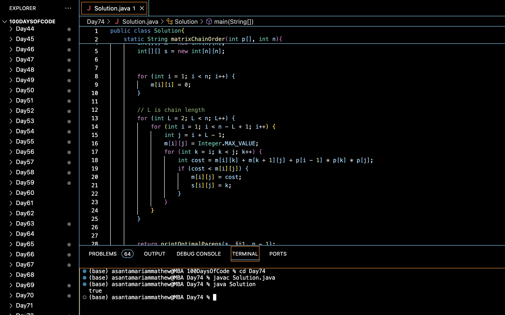

# BRACKETS IN MATRIX CHAIN MULTIPLICATION :blush:
## DAY :seven: :four: -January 27, 2024

## Code Overview

This Java code solves the matrix chain multiplication problem using dynamic programming. It finds the most efficient way to multiply a sequence of matrices to minimize the number of scalar multiplications needed.

## Key Features

- Utilizes dynamic programming to optimize the matrix chain multiplication process.
- Implements the matrix chain order algorithm to find the optimal parenthesization of matrices.
- Provides a clear interface for input and output.

## Code Breakdown

- **Solution Class**: 
  - Defines a class `Solution` with static methods `matrixChainOrder` and `printOptimalParens` to solve the matrix chain multiplication problem.
  - Uses dynamic programming to calculate the minimum number of scalar multiplications needed for multiplying matrices.
  - Returns the optimal parenthesization of matrices.

- **Main Function**:
  - Initializes the number of matrices `n` and an array `p` containing the dimensions of the matrices in the `main` function.
  - Calls the `matrixChainOrder` method to find the optimal parenthesization of matrices.
  - Prints whether the obtained optimal parenthesization matches the expected result.

## Usage

1. Compile the Java code.
2. Run the compiled Java program.
3. The program will output whether the obtained optimal parenthesization matches the expected result based on the provided dimensions of matrices.

## Output

## Link
<https://auth.geeksforgeeks.org/user/asantamarptz2>
