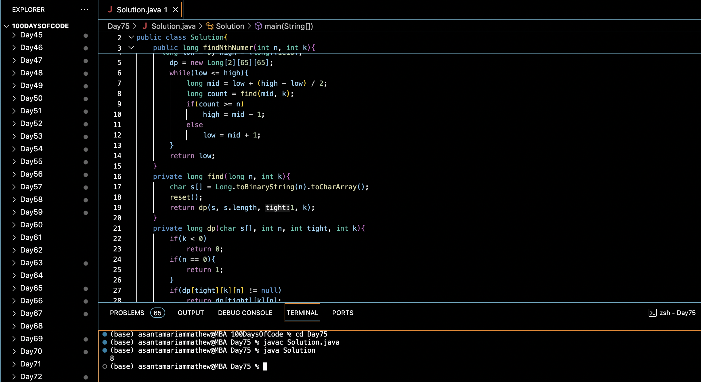

# GEEKINA HATES 1's :blush:
## DAY :seven: :five: -January 28, 2024

## Code Overview

This Java code finds the Nth number with exactly K bits set in its binary representation using dynamic programming and binary search.

## Key Features

- Utilizes dynamic programming to efficiently calculate the Nth number with K bits set.
- Employs binary search to find the Nth number with exactly K bits set within a specified range.
- Provides a clear interface for input and output.

## Code Breakdown

- **Solution Class**: 
  - Defines a class `Solution` with methods to find the Nth number with exactly K bits set (`findNthNumber`), calculate the number of valid numbers within a range (`find`), and perform dynamic programming to optimize calculations (`dp`).
  - Employs binary search to find the Nth number with K bits set within the given range.

- **Main Function**:
  - Initializes the value of N and K in the `main` function.
  - Calls the `findNthNumber` method to find the Nth number with exactly K bits set.
  - Prints the obtained Nth number with K bits set.

## Usage

1. Compile the Java code.
2. Run the compiled Java program.
3. The program will output the Nth number with exactly K bits set based on the provided values of N and K.

## Output

## Link
<https://auth.geeksforgeeks.org/user/asantamarptz2>
