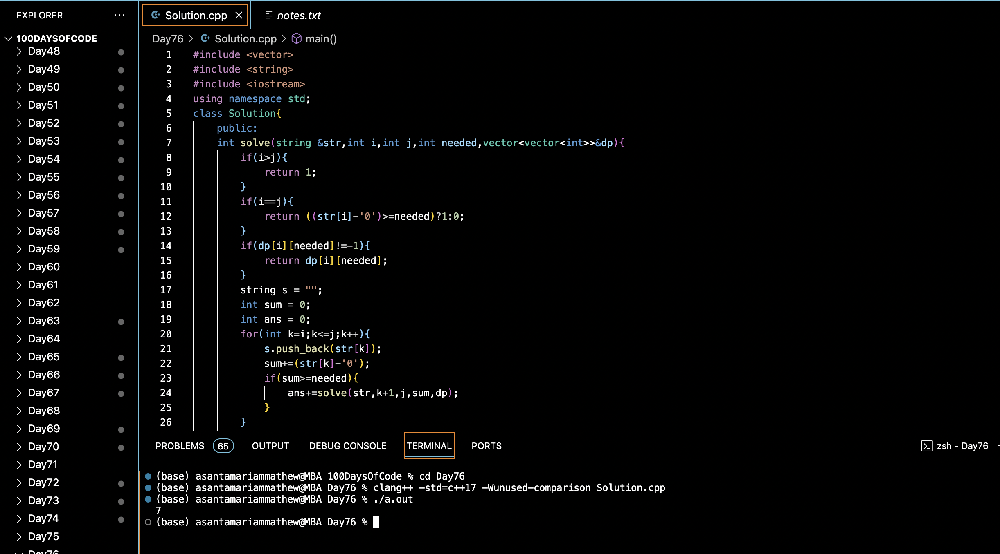

# COUNT DIGIT GROUPINGS OF A NUMBER :blush:
## DAY :seven: :six: -January 29, 2024

## Code Overview

This C++ code counts the number of substrings in a given string where the sum of digits in each substring is equal to a specified value.

## Key Features

- Utilizes dynamic programming to efficiently calculate the count of substrings with a sum equal to the given number.
- Implements a recursive approach to explore all possible substrings and count the valid ones.
- Provides a clear interface for input and output.

## Code Breakdown

- **Solution Class**: 
  - Defines a class `Solution` with methods to recursively count the number of substrings with a sum equal to the given number (`solve`) and to calculate the total count of such substrings in the entire string (`TotalCount`).

- **Main Function**:
  - Initializes the input string in the `main` function.
  - Calls the `TotalCount` method of the `Solution` class to calculate the total count of substrings with a sum equal to the specified value.
  - Prints the obtained count of such substrings.

## Usage

1. Compile the C++ code.
2. Run the compiled C++ program.
3. The program will output the total count of substrings with a sum equal to the given number based on the provided input string.

## Output

## Link
<https://auth.geeksforgeeks.org/user/asantamarptz2>
