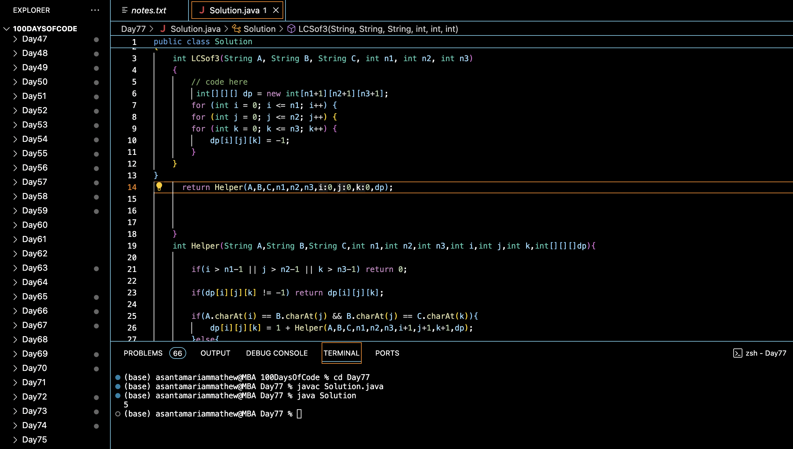

# LCS OF THREE STRINGS :blush:
## DAY :seven: :seven: -January 30, 2024

## Code Overview

This Java code calculates the length of the longest common subsequence (LCS) of three given strings. It utilizes dynamic programming to efficiently solve the problem.

## Key Features

- Utilizes dynamic programming to solve the longest common subsequence problem for three given strings.
- Implements a recursive approach with memoization to avoid redundant computations and improve efficiency.
- Provides a clear interface for input and output.

## Code Breakdown

- **Solution Class**: 
  - Defines a class `Solution` with methods to calculate the LCS of three strings (`LCSof3`) and a helper method (`Helper`) to perform the recursive computation with memoization.

- **Main Function**:
  - Initializes three input strings (`A`, `B`, and `C`) and their lengths (`n1`, `n2`, and `n3`) in the `main` function.
  - Calls the `LCSof3` method of the `Solution` class to calculate the length of the longest common subsequence of the three strings.
  - Prints the obtained length of the LCS.

## Usage

1. Compile the Java code.
2. Run the compiled Java program.
3. The program will output the length of the longest common subsequence of the three given strings based on the provided input.

## Output

## Link
<https://auth.geeksforgeeks.org/user/asantamarptz2>
