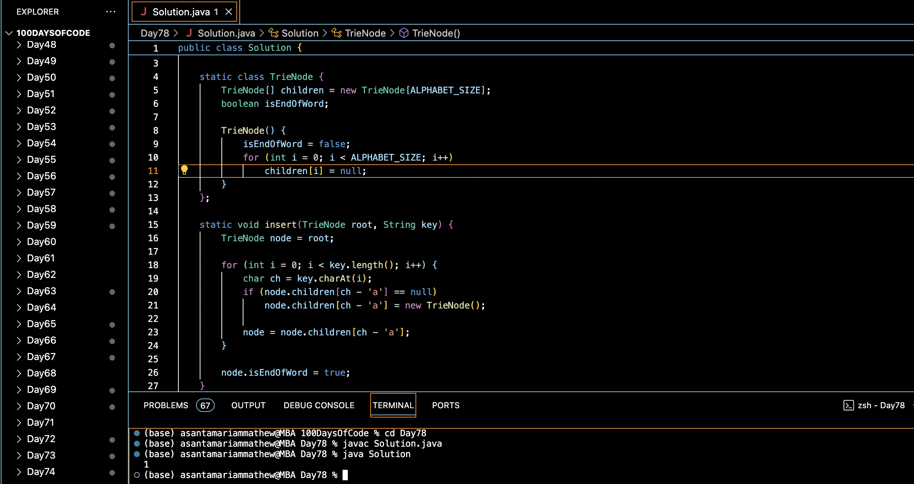

# INSERT AND SEARCH IN A TRIE :blush:
## DAY :seven: :eight: -January 31, 2024

## Code Overview

This Java code implements a trie data structure for efficient string storage and retrieval. It defines a TrieNode class to represent each node in the trie and provides methods to insert strings into the trie and search for strings within the trie.

## Key Features

- **TrieNode Class**:
  - Defines a nested class `TrieNode` to represent nodes in the trie.
  - Each node contains an array of TrieNode references, representing children nodes for each letter of the alphabet, and a boolean flag indicating whether the node represents the end of a word.

- **Insert Method**:
  - Defines a static method `insert` to insert a string into the trie.
  - Traverses the trie, creating new nodes as necessary for each character in the input string.

- **Search Method**:
  - Defines a static method `search` to search for a string in the trie.
  - Traverses the trie, checking for the existence of each character in the input string.

- **Main Function**:
  - Initializes a list of strings (`list`) and a search key (`key`) in the `main` function.
  - Creates an instance of the TrieNode class (`root`) to represent the root of the trie.
  - Inserts each string from the list into the trie using the `insert` method.
  - Searches for the key in the trie using the `search` method.
  - Prints `1` if the key is found in the trie, otherwise prints `0`.

## Code Breakdown

- **Solution Class**:
  - Defines a class `Solution` containing static methods for trie insertion and search, as well as the main function.

## Usage

1. Compile the Java code.
2. Run the compiled Java program.
3. The program will output `1` if the search key is found in the trie, otherwise it will output `0`.

## Output

## Link
<https://auth.geeksforgeeks.org/user/asantamarptz2>
