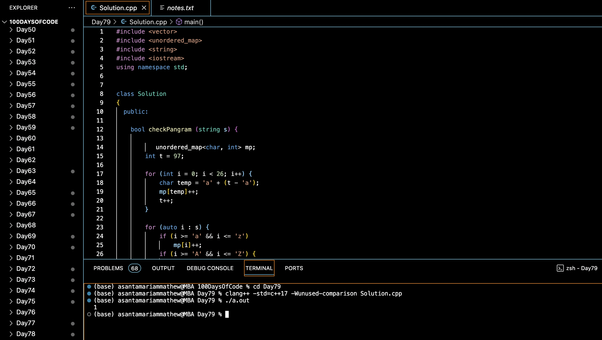

# PANAGRAM CHECKING :blush:
## DAY :seven: :nine: -February 1, 2024

## Code Overview

This C++ code checks whether a given string is a pangram, i.e., it contains at least one instance of every letter of the alphabet (case-insensitive). The code defines a `Solution` class with a method to check for pangrams and a `main` function to demonstrate its usage.

## Key Features

- **Solution Class**:
  - Defines a class `Solution` containing a method `checkPangram` to determine whether a given string is a pangram.
  - Uses an unordered map to store the frequency of each letter in the alphabet.
  - Iterates over the input string to count the occurrences of each letter, ignoring non-alphabetic characters.

- **checkPangram Method**:
  - Initializes an unordered map (`mp`) to store the frequency of each letter in the alphabet.
  - Iterates over the alphabet and adds each letter to the map with an initial count of zero.
  - Iterates over the input string (`s`) and increments the count of each letter encountered.
  - Converts uppercase letters to lowercase before updating the count.

- **Main Function**:
  - Initializes a string (`s`) with the input sentence to be checked for pangrammaticity.
  - Creates an instance of the `Solution` class (`sol`).
  - Calls the `checkPangram` method to determine whether the input string is a pangram.
  - Prints `1` if the string is a pangram and `0` otherwise.

## Code Breakdown

- **Solution Class**:
  - Defines a class `Solution` containing a method `checkPangram` to determine whether a given string is a pangram.

- **Main Function**:
  - Initializes a string (`s`) with the input sentence to be checked for pangrammaticity.
  - Creates an instance of the `Solution` class (`sol`).
  - Calls the `checkPangram` method to determine whether the input string is a pangram.
  - Prints `1` if the string is a pangram and `0` otherwise.

## Usage

1. Compile the C++ code.
2. Run the compiled program.
3. The program will output `1` if the input string is a pangram, otherwise it will output `0`.

## Output

## Link
<https://auth.geeksforgeeks.org/user/asantamarptz2>
