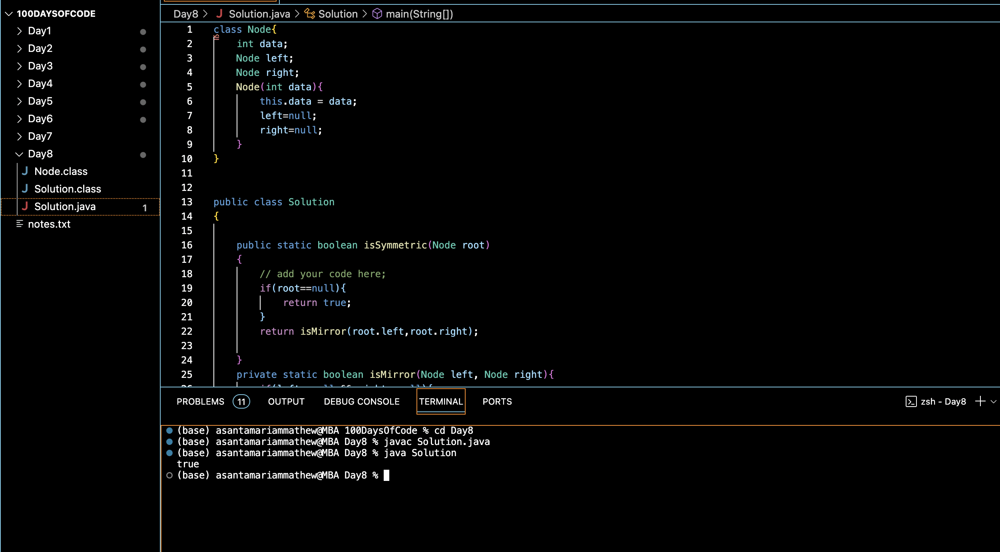

# SYMMETRIC TREE:blush:
## DAY :eight: -November 22, 2023

## Code Overview
This code defines a Java class Node representing a node in a binary tree and a class Solution with a method to determine if a binary tree is symmetric.

## Key Features
**Node Class**: Represents a node in a binary tree with an integer data value and references to its left and right child nodes.

**isSymmetric Method**: Determines whether a binary tree is symmetric by checking if its left and right subtrees are mirror images of each other.

**isMirror Method**: Recursively compares the left and right subtrees to check if they are mirrors of each other.

## Code Breakdown
**Node Class**:

-int data: Holds the integer value of the node.
Node left, right: References to the left and right child nodes.

-Node(int data): Constructor initializing the node with the given data and setting left and right references to null.

**Solution Class**:

-isSymmetric(Node root): Checks if the binary tree with the given root is symmetric by invoking the isMirror method.

-isMirror(Node left, Node right): Recursively checks if the left and right subtrees are mirrors of each other.

-main(String[] args): Entry point of the program. Creates a binary tree with sample data, checks its symmetry, and prints the result.

## Usage
1. Define a binary tree by creating instances of the Node class and linking them appropriately.
2. Create an instance of the Solution class.
3. Call the isSymmetric method with the root node of the binary tree as an argument.
4. Print the result obtained.

## Output

## Link
<https://auth.geeksforgeeks.org/user/asantamarptz2>