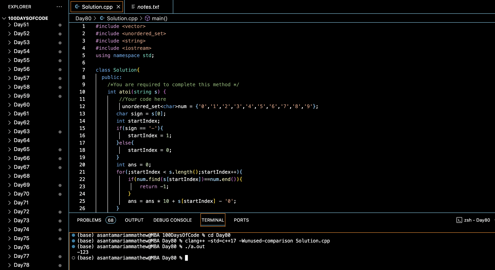

# IMPLEMENT ATOI :blush:
## DAY :eight: :zero: -February 2, 2024

## Code Overview

This C++ code implements a function to convert a string to an integer. The `atoi` function defined in the `Solution` class takes a string containing a numerical value and returns the corresponding integer value. The `main` function demonstrates the usage of this function by converting a string to an integer and printing the result.

## Key Features

- **Solution Class**:
  - Defines a class `Solution` containing a method `atoi` to convert a string to an integer.
  - Uses an unordered set to store the characters representing numerical digits.
  - Handles positive and negative numbers.

- **atoi Method**:
  - Takes a string (`s`) as input and converts it to an integer.
  - Parses the string character by character, converting each digit to its integer value and accumulating the result.
  - Handles the sign of the number appropriately.
  - Returns `-1` if the input string contains non-numeric characters.

- **Main Function**:
  - Initializes a string (`s`) with the input numerical string.
  - Creates an instance of the `Solution` class (`sol`).
  - Calls the `atoi` method to convert the input string to an integer.
  - Prints the resulting integer value.

## Code Breakdown

- **Solution Class**:
  - Defines a class `Solution` containing a method `atoi` to convert a string to an integer.

- **atoi Method**:
  - Takes a string (`s`) as input and converts it to an integer.
  - Parses the string character by character, converting each digit to its integer value and accumulating the result.
  - Handles the sign of the number appropriately.
  - Returns `-1` if the input string contains non-numeric characters.

- **Main Function**:
  - Initializes a string (`s`) with the input numerical string.
  - Creates an instance of the `Solution` class (`sol`).
  - Calls the `atoi` method to convert the input string to an integer.
  - Prints the resulting integer value.

## Usage

1. Compile the C++ code.
2. Run the compiled program.
3. The program will convert the input string to an integer and print the result.

## Output

## Link
<https://auth.geeksforgeeks.org/user/asantamarptz2>