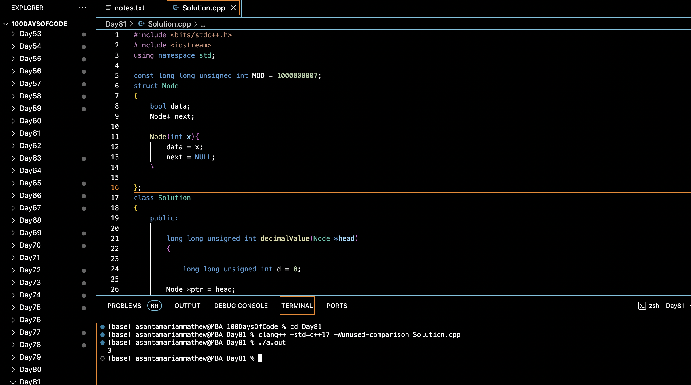

# DECIMAL EQUIVALENT OF BINARY LINKED LIST :blush:
## DAY :eight: :one: -February 3, 2024

## Code Overview

This C++ code implements a class to convert a binary linked list representation to its decimal equivalent. The `decimalValue` function defined in the `Solution` class takes the head of a linked list containing binary digits (0s and 1s) and returns the decimal value represented by the binary linked list. The `main` function demonstrates the usage of this function by creating a binary linked list and converting it to its decimal representation.

## Key Features

- **Solution Class**:
  - Defines a class `Solution` containing a method `decimalValue` to convert a binary linked list to its decimal equivalent.
  - Implements the logic to traverse the linked list and calculate the decimal value by traversing the linked list from left to right.

- **decimalValue Method**:
  - Takes the head of a binary linked list (`head`) as input and converts it to its decimal equivalent.
  - Uses bitwise left shift (`<<`) and modulo operations to compute the decimal value efficiently.
  - Returns the decimal value as an unsigned long long integer.

- **Main Function**:
  - Creates a binary linked list with given binary digits (0s and 1s).
  - Creates an instance of the `Solution` class (`sol`).
  - Calls the `decimalValue` method to convert the binary linked list to its decimal equivalent.
  - Prints the resulting decimal value.
  - Deletes the dynamically allocated memory used by the linked list nodes to prevent memory leaks.

## Code Breakdown

- **Solution Class**:
  - Defines a class `Solution` containing a method `decimalValue` to convert a binary linked list to its decimal equivalent.

- **decimalValue Method**:
  - Takes the head of a binary linked list (`head`) as input and converts it to its decimal equivalent.
  - Uses bitwise left shift (`<<`) and modulo operations to compute the decimal value efficiently.
  - Returns the decimal value as an unsigned long long integer.

- **Main Function**:
  - Creates a binary linked list with given binary digits (0s and 1s).
  - Creates an instance of the `Solution` class (`sol`).
  - Calls the `decimalValue` method to convert the binary linked list to its decimal equivalent.
  - Prints the resulting decimal value.
  - Deletes the dynamically allocated memory used by the linked list nodes to prevent memory leaks.

## Usage

1. Compile the C++ code.
2. Run the compiled program.
3. The program will create a binary linked list, convert it to its decimal representation, and print the result.

## Output

## Link
<https://auth.geeksforgeeks.org/user/asantamarptz2>
