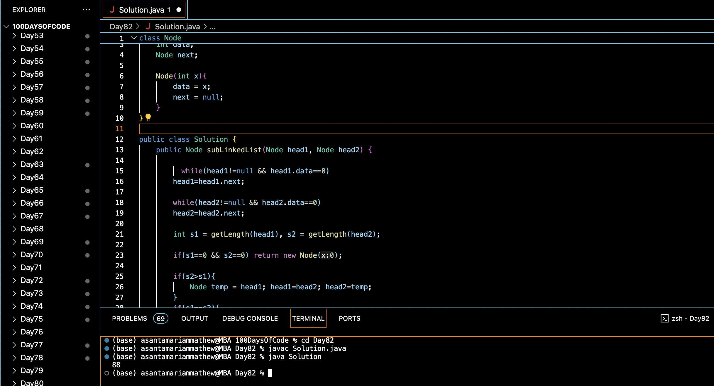

# SUBTRACTION IN LINKED LIST :blush:
## DAY :eight: :two: -February 4, 2024

# Code Overview

This code is a Java implementation of a solution to perform subtraction operation on two linked lists representing numbers. The linked lists contain nodes where each node stores a digit of the number in reverse order. The code subtracts the second linked list from the first linked list and returns the resulting linked list.

## Key Features

- **Node Class**:
  - Defines a class `Node` to represent a node in a linked list.
  - Each `Node` contains an integer `data` representing a digit of the number and a reference to the next node.

- **Subtraction Function**:
  - Implements the `subLinkedList` function to perform subtraction operation on two linked lists.
  - Traverses both linked lists simultaneously, subtracting corresponding digits and creating a new linked list to store the result.
  - Handles carryover during subtraction and adjusts digits accordingly.
  - Returns the resulting linked list after subtraction.

- **Utility Functions**:
  - Defines utility functions `getLength` and `reverse` to get the length of a linked list and reverse a linked list, respectively.

- **Main Function**:
  - Demonstrates the usage of the subtraction function by creating two linked lists representing numbers and calling the `subLinkedList` function to perform subtraction.
  - Prints the resulting linked list representing the subtraction result.

## Code Breakdown

- **Node Class**:
  - Defines a class `Node` containing an integer `data` representing a digit of the number and a reference to the next node.

- **Subtraction Function**:
  - Performs subtraction operation on two linked lists representing numbers.
  - Traverses both linked lists simultaneously, subtracting corresponding digits and creating a new linked list to store the result.
  - Handles carryover during subtraction and adjusts digits accordingly.
  - Returns the resulting linked list after subtraction.

- **Utility Functions**:
  - `getLength`: Computes the length of a linked list.
  - `reverse`: Reverses a linked list.

- **Main Function**:
  - Demonstrates the usage of the subtraction function by creating two linked lists representing numbers and calling the `subLinkedList` function to perform subtraction.
  - Prints the resulting linked list representing the subtraction result.

## Usage

1. Compile the Java code.
2. Run the compiled program.
3. The program will create two linked lists representing numbers, perform subtraction, and print the resulting linked list representing the subtraction result.

## Output

## Link
<https://auth.geeksforgeeks.org/user/asantamarptz2>