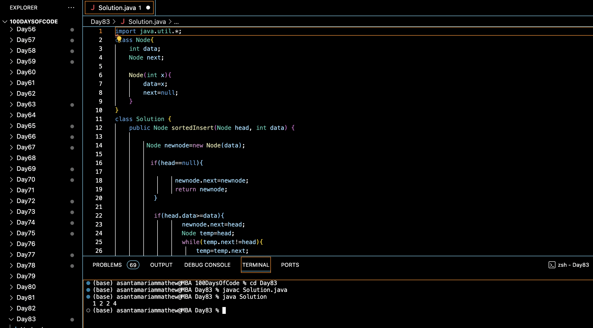

# SORTED INSERT FOR CIRCULAR LINKED LIST :blush:
## DAY :eight: :three: -February 5, 2024

# Code Overview

This code is a Java implementation of a solution to insert a node into a sorted circular linked list. The circular linked list is sorted in ascending order. The code inserts the new node at the appropriate position in the list while maintaining the sorting order.

## Key Features

- **Node Class**:
  - Defines a class `Node` to represent a node in a linked list.
  - Each `Node` contains an integer `data` representing the value of the node and a reference to the next node.

- **Insertion Function**:
  - Implements the `sortedInsert` function to insert a new node into a sorted circular linked list.
  - Handles three cases:
    - If the list is empty, the new node becomes the head of the list.
    - If the value of the new node is less than or equal to the value of the head node, the new node is inserted before the head node, and the references are updated accordingly.
    - If the value of the new node is greater than the value of the head node, the new node is inserted at the appropriate position in the list while maintaining the sorting order.

- **Main Function**:
  - Demonstrates the usage of the insertion function by creating a sorted circular linked list and calling the `sortedInsert` function to insert a new node into the list.
  - Prints the values of all nodes in the modified linked list.

## Code Breakdown

- **Node Class**:
  - Defines a class `Node` containing an integer `data` representing the value of the node and a reference to the next node.

- **Insertion Function (`sortedInsert`)**:
  - Inserts a new node into a sorted circular linked list while maintaining the sorting order.
  - Handles three cases:
    - If the list is empty, the new node becomes the head of the list.
    - If the value of the new node is less than or equal to the value of the head node, the new node is inserted before the head node, and the references are updated accordingly.
    - If the value of the new node is greater than the value of the head node, the new node is inserted at the appropriate position in the list while maintaining the sorting order.

- **Main Function**:
  - Demonstrates the usage of the insertion function by creating a sorted circular linked list and calling the `sortedInsert` function to insert a new node into the list.
  - Prints the values of all nodes in the modified linked list.

## Usage

1. Compile the Java code.
2. Run the compiled program.
3. The program will create a sorted circular linked list, insert a new node into the list, and print the values of all nodes in the modified linked list.

## Output

## Link
<https://auth.geeksforgeeks.org/user/asantamarptz2>
