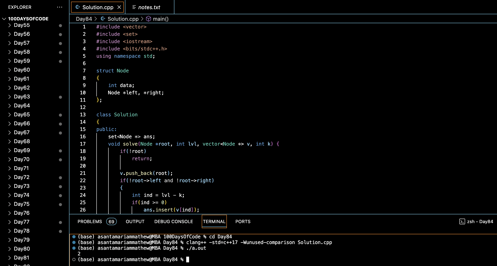

# COUNT THE NODES AT DISTANCEK FROM LEAF :blush:
## DAY :eight: :four: -February 6, 2024

## Code Overview

This code implements a solution to find the number of nodes in a binary tree that are at a distance k from a leaf node. It uses a recursive approach to traverse the tree and find the desired nodes.

## Key Features

- **Node Structure**:
  - Defines a structure `Node` to represent a node in a binary tree.
  - Each node contains an integer `data`, a pointer to the left child node (`left`), and a pointer to the right child node (`right`).

- **Solution Class**:
  - Implements a method `printKDistantfromLeaf` to find the number of nodes at a distance `k` from a leaf node in the binary tree.
  - Utilizes a recursive function `solve` to traverse the tree and collect nodes at the required distance from leaf nodes.
  - Uses a set to store unique nodes found at the specified distance from leaf nodes.

- **Main Function**:
  - Creates a binary tree with sample data.
  - Calls the `printKDistantfromLeaf` method to find the number of nodes at a distance `k` from leaf nodes.
  - Prints the output.

## Code Breakdown

- **Node Structure**:
  - Defines a structure `Node` containing an integer `data`, a pointer to the left child node (`left`), and a pointer to the right child node (`right`).

- **Solution Class**:
  - Implements a method `solve` to recursively traverse the binary tree and collect nodes at a distance `k` from leaf nodes.
  - Stores collected nodes in a set to ensure uniqueness.
  - Defines the `printKDistantfromLeaf` method to initialize data structures, call the recursive `solve` function, and return the count of unique nodes found.

- **Main Function**:
  - Creates a binary tree with sample data by allocating memory for nodes and assigning data values.
  - Calls the `printKDistantfromLeaf` method of the `Solution` class to find the number of nodes at a distance `k` from leaf nodes.
  - Prints the output.

## Usage

1. Compile the C++ code.
2. Run the compiled program.
3. The program will create a binary tree with sample data, find the number of nodes at a distance `k` from leaf nodes, and print the output.

## Output

## Link
<https://auth.geeksforgeeks.org/user/asantamarptz2>
