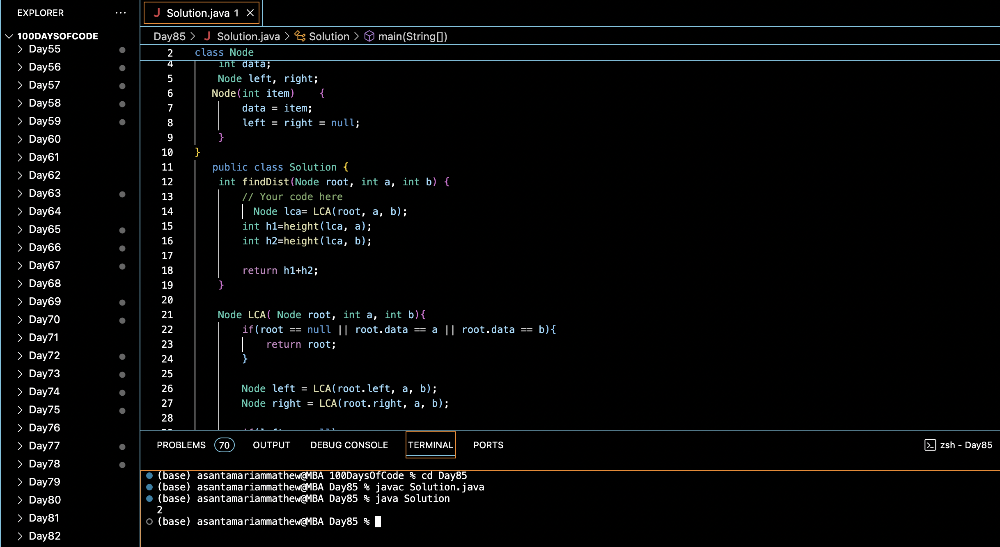

# MIN DISTANCE BETWEEN TWO GIVEN NODES OF A BINARY TREE :blush:
## DAY :eight: :five: -February 7, 2024

# Code Overview

This code implements a solution to find the distance between two nodes in a binary tree. It finds the Lowest Common Ancestor (LCA) of the two nodes, then calculates the distances of each node from the LCA, and finally computes the sum of these distances to find the total distance between the nodes.

## Key Features

- **Node Structure**:
  - Defines a structure `Node` to represent a node in a binary tree.
  - Each node contains an integer `data`, a pointer to the left child node (`left`), and a pointer to the right child node (`right`).

- **Solution Class**:
  - Implements methods to find the Lowest Common Ancestor (LCA) of two nodes and calculate the height of a node in the tree.
  - Computes the distance between two nodes by finding their LCA and then calculating the distances of each node from the LCA.

- **Main Function**:
  - Creates a binary tree with sample data.
  - Calls the `findDist` method to find the distance between two nodes.
  - Prints the output.

## Code Breakdown

- **Node Structure**:
  - Defines a structure `Node` containing an integer `data`, a pointer to the left child node (`left`), and a pointer to the right child node (`right`).

- **Solution Class**:
  - Implements methods:
    - `LCA`: Finds the Lowest Common Ancestor (LCA) of two nodes in the binary tree.
    - `height`: Calculates the height of a node in the tree.
    - `findDist`: Computes the distance between two nodes by finding their LCA and summing their distances from the LCA.

- **Main Function**:
  - Creates a binary tree with sample data by allocating memory for nodes and assigning data values.
  - Calls the `findDist` method of the `Solution` class to find the distance between two nodes.
  - Prints the output.

## Usage

1. Compile the Java code.
2. Run the compiled program.
3. The program will create a binary tree with sample data, find the distance between two nodes, and print the output.

## Output

## Link
<https://auth.geeksforgeeks.org/user/asantamarptz2>