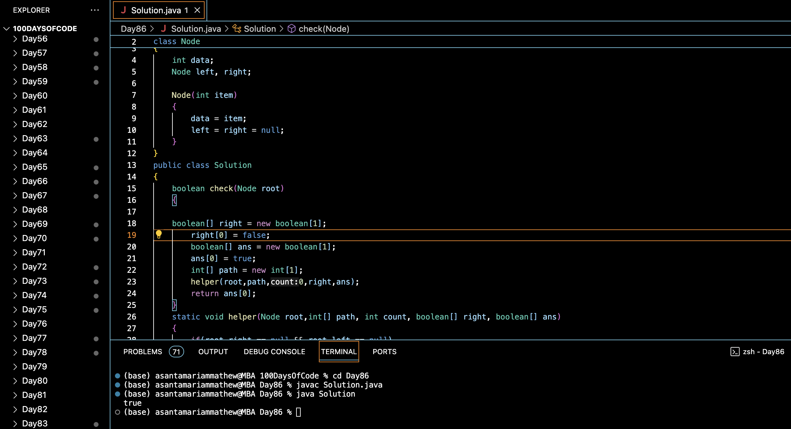

# CHECK IF ALL LEAVES ARE AT THE SAME LEVEL :blush:
## DAY :eight: :six: -February 8, 2024

## Code Overview

This code checks if all leaf nodes of a binary tree are at the same level or not. It traverses the tree and checks if all leaf nodes have the same depth. If they do, it returns true; otherwise, it returns false.

## Key Features

- **Node Structure**:
  - Defines a structure `Node` to represent a node in a binary tree.
  - Each node contains an integer `data`, a pointer to the left child node (`left`), and a pointer to the right child node (`right`).

- **Solution Class**:
  - Implements a method `check` to check if all leaf nodes are at the same level or not.
  - Utilizes helper functions to traverse the tree and keep track of the depth of leaf nodes.

## Code Breakdown

- **Node Structure**:
  - Defines a structure `Node` containing an integer `data`, a pointer to the left child node (`left`), and a pointer to the right child node (`right`).

- **Solution Class**:
  - Implements methods:
    - `check`: Checks if all leaf nodes are at the same level by traversing the tree and keeping track of the depth of leaf nodes. Returns true if all leaf nodes have the same depth; otherwise, returns false.
    - `helper`: Recursive helper function to traverse the tree and update the depth of leaf nodes.

- **Main Function**:
  - Creates a binary tree with sample data by allocating memory for nodes and assigning data values.
  - Calls the `check` method of the `Solution` class to check if all leaf nodes are at the same level.
  - Prints the output.

## Usage

1. Compile the Java code.
2. Run the compiled program.
3. The program will create a binary tree with sample data, check if all leaf nodes are at the same level, and print the output.

## Output

## Link
<https://auth.geeksforgeeks.org/user/asantamarptz2>
