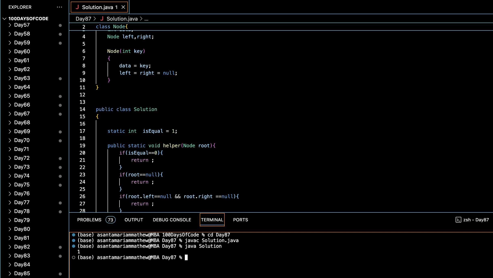

# CHECK FOR CHILDREN SUM PROPERTY IN A BINARY TREE :blush:
## DAY :eight: :seven: -February 9, 2024

## Code Overview

This Java code checks whether a given binary tree satisfies the children sum property or not. According to the children sum property, for every node in the tree, the sum of its children (if any) should be equal to the node's value.

## Key Features

- **Node Structure**:
  - Defines a structure `Node` to represent a node in a binary tree.
  - Each node contains an integer `data`, a pointer to the left child node (`left`), and a pointer to the right child node (`right`).

- **Solution Class**:
  - Implements a method `isSumProperty` to check whether the binary tree satisfies the children sum property.
  - Utilizes a helper function to traverse the tree and verify the children sum property for each node.

## Code Breakdown

- **Node Structure**:
  - Defines a structure `Node` containing an integer `data`, a pointer to the left child node (`left`), and a pointer to the right child node (`right`).

- **Solution Class**:
  - Implements methods:
    - `isSumProperty`: Checks whether the given binary tree satisfies the children sum property by calling the `helper` function. Returns 1 if the property is satisfied; otherwise, returns 0.
    - `helper`: Recursive helper function to traverse the binary tree and verify the children sum property for each node.

- **Main Function**:
  - Creates a binary tree with sample data by allocating memory for nodes and assigning data values.
  - Calls the `isSumProperty` method of the `Solution` class to check if the binary tree satisfies the children sum property.
  - Prints the output.

## Usage

1. Compile the Java code.
2. Run the compiled program.
3. The program will create a binary tree with sample data, check if it satisfies the children sum property, and print the output.

## Output

## Link
<https://auth.geeksforgeeks.org/user/asantamarptz2>
