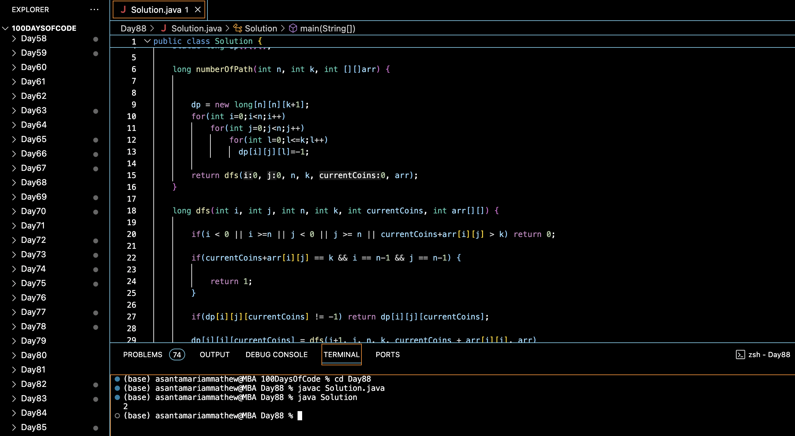

# NUMBER OF PATHS IN A MATRIX WITH K COINS :blush:
## DAY :eight: :eight: -February 10, 2024

## Code Overview

This Java code calculates the number of paths from the top-left corner of a grid to the bottom-right corner while ensuring that the sum of coins collected along the path equals a given value `k`.

## Key Features

- **Dynamic Programming**:
  - Utilizes dynamic programming to store and reuse previously calculated results, optimizing the performance of path calculations.
  
- **Recursive DFS**:
  - Implements a depth-first search (DFS) algorithm recursively to traverse the grid and count the number of valid paths.
  
- **Memoization**:
  - Employs memoization by storing intermediate results in a three-dimensional array to avoid redundant calculations and improve efficiency.

## Code Breakdown

- **`numberOfPath` Method**:
  - Initializes a dynamic programming array `dp` to store previously calculated results.
  - Calls the recursive DFS function `dfs` to traverse the grid and count the number of valid paths with the given constraints.
  - Returns the total number of valid paths found.

- **`dfs` Method**:
  - Performs a depth-first search (DFS) traversal of the grid.
  - Checks boundary conditions and constraints to determine valid path segments.
  - Utilizes memoization to store and reuse intermediate results during the traversal.
  - Recursively explores possible paths while updating the sum of coins collected.

- **Main Function**:
  - Defines the grid size `n`, target sum `k`, and the grid array `arr`.
  - Creates an instance of the `Solution` class and calls the `numberOfPath` method to calculate the number of valid paths.
  - Prints the output.

## Usage

1. Compile the Java code.
2. Run the compiled program.
3. The program will calculate the number of valid paths from the top-left corner to the bottom-right corner of the grid, ensuring that the sum of coins collected equals the specified value `k`, and print the output.

## Output

## Link
<https://auth.geeksforgeeks.org/user/asantamarptz2>
