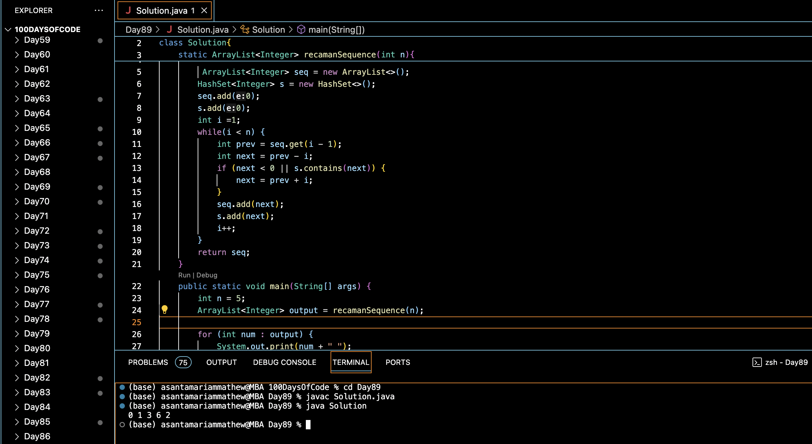

# RECAMANS SEQUENCE :blush:
## DAY :eight: :nine: -February 11, 2024

## Code Overview

This Java code generates the Recaman sequence up to a specified limit `n`.

## Key Features

- **Recaman Sequence Generation**:
  - Calculates the Recaman sequence using a defined algorithm.
  
- **HashSet for Efficiency**:
  - Utilizes a HashSet to efficiently check for duplicate elements in the sequence.

## Code Breakdown

- **`recamanSequence` Method**:
  - Initializes an ArrayList `seq` to store the Recaman sequence.
  - Uses a HashSet `s` to track visited elements for efficient duplicate checking.
  - Implements the Recaman sequence generation algorithm, appending each element to the sequence.
  - Returns the generated Recaman sequence.

- **Main Function**:
  - Defines the limit `n` for generating the Recaman sequence.
  - Calls the `recamanSequence` method to generate the sequence up to `n`.
  - Prints the generated sequence.

## Usage

1. Compile the Java code.
2. Run the compiled program.
3. The program will generate the Recaman sequence up to the specified limit `n` and print the sequence.

## Output

## Link
<https://auth.geeksforgeeks.org/user/asantamarptz2>
