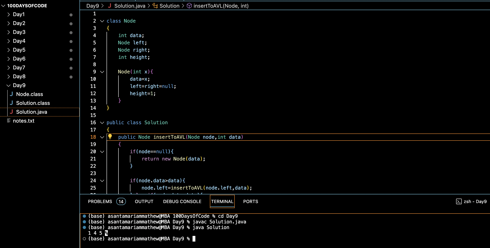

# AVL TREE INSERTION :blush:
## DAY :nine: -November 23, 2023

## Code Overview
This Java code implements an AVL (Adelson-Velsky and Landis) tree with insertion functionality. It includes a Node class to represent individual nodes in the AVL tree and a Solution class containing methods for insertion, rotations, and inorder traversal.

## Key Features
**Node Class**: Represents a node in the AVL tree with integer data, references to left and right child nodes, and a height attribute for balancing.

**Insertion Method**: insertToAVL method inserts a new node with the specified data into the AVL tree while maintaining its balance.

**Rotation Methods**: leftRotate and rightRotate methods perform left and right rotations, respectively, to balance the AVL tree.

**Height Calculation**: height method calculates and returns the height of the specified node in the AVL tree.

**Inorder Traversal**: inorderTraversal method performs an inorder traversal of the AVL tree, printing the node values in sorted order.

## Code Breakdown
**Node Class**:

-int data: Represents the integer value stored in the node.
Node left, right: References to the left and right child nodes.

-int height: Represents the height of the node in the AVL tree.

-Node(int x): Constructor initializing the node with the given data and setting left and right references to null, with initial height as 1.

**Solution Class**:

-insertToAVL: Inserts a new node into the AVL tree while maintaining balance.

-leftRotate and rightRotate: Perform left and right rotations to balance the AVL tree.

-height: Calculates the height of the node in the AVL tree.

-inorderTraversal: Performs an inorder traversal of the AVL tree to print node values in sorted order.

-main: Entry point of the program. Inserts values into the AVL tree and performs an inorder traversal.

## Usage
1. Define an array of values to be inserted into the AVL tree.
2. Create an instance of the Solution class.
3. Insert values into the AVL tree using the insertToAVL method.
4. Perform an inorder traversal of the AVL tree using the inorderTraversal method to print the node values in sorted order.

## Output

## Link
<https://auth.geeksforgeeks.org/user/asantamarptz2>