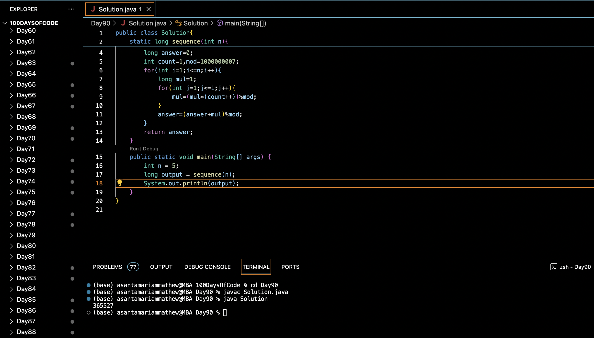

# RECURSIVE SEQUENCE :blush:
## DAY :nine: :zero: -February 12, 2024

## Code Overview

This Java code calculates the value of a sequence up to a specified limit `n`.

## Key Features

- **Sequence Calculation**:
  - Computes the value of a sequence based on the given algorithm.

- **Modular Arithmetic**:
  - Utilizes modular arithmetic to handle large numbers and prevent overflow.

## Code Breakdown

- **`sequence` Method**:
  - Initializes variables for the sequence calculation, including `answer`, `count`, and `mod`.
  - Iterates through each element of the sequence up to `n`.
  - Computes the value of each element using nested loops and modular arithmetic.
  - Returns the calculated value of the sequence.

- **Main Function**:
  - Defines the limit `n` for calculating the sequence.
  - Calls the `sequence` method to compute the sequence value up to `n`.
  - Prints the computed sequence value.

## Usage

1. Compile the Java code.
2. Run the compiled program.
3. The program will calculate the value of the sequence up to the specified limit `n` and print the result.

## Output

## Link
<https://auth.geeksforgeeks.org/user/asantamarptz2>
