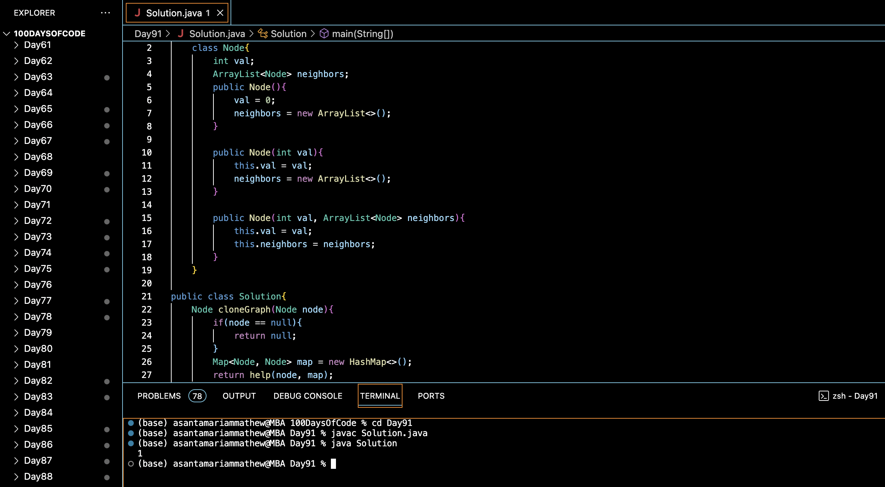

# CLONE AN UNDIRECTED GRAPH :blush:
## DAY :nine: :one: -February 13, 2024

## Code Overview

This Java code provides a solution to clone a graph represented as a collection of nodes and their neighbors.

## Key Features

- **Node Class**:
  - Defines a `Node` class with an integer value (`val`) and a list of neighboring nodes (`neighbors`).
  - Provides constructors to initialize the node with or without values and neighbors.

- **Clone Graph Method**:
  - Implements a `cloneGraph` method in the `Solution` class to create a deep copy of the input graph.
  - Utilizes a recursive helper function (`help`) to traverse the original graph and create a clone.
  - Uses a `HashMap` to keep track of the mapping between original nodes and their corresponding clones.

## Code Breakdown

- **`cloneGraph` Method**:
  - Takes the input `node` as an argument and returns a cloned graph.
  - Checks if the input node is null and returns null if so.
  - Initializes a HashMap to store the mapping between original and cloned nodes.
  - Calls the helper function `help` to perform the cloning process.

- **`help` Method**:
  - Takes an original node (`org`) and a mapping `map` as arguments.
  - Recursively clones the original graph by traversing through its neighbors.
  - Creates a new clone node for each original node encountered and adds it to the map.
  - Clones the neighbors of the original node and adds them to the cloned node.

- **Main Function**:
  - Creates a sample graph with multiple nodes and edges.
  - Calls the `cloneGraph` method to clone the graph starting from a specified node.
  - Prints the value of the cloned node to verify the cloning process.

## Usage

1. Compile the Java code.
2. Run the compiled program.
3. The program will clone the input graph and print the value of the cloned node to verify successful cloning.

## Output

## Link
<https://auth.geeksforgeeks.org/user/asantamarptz2>
