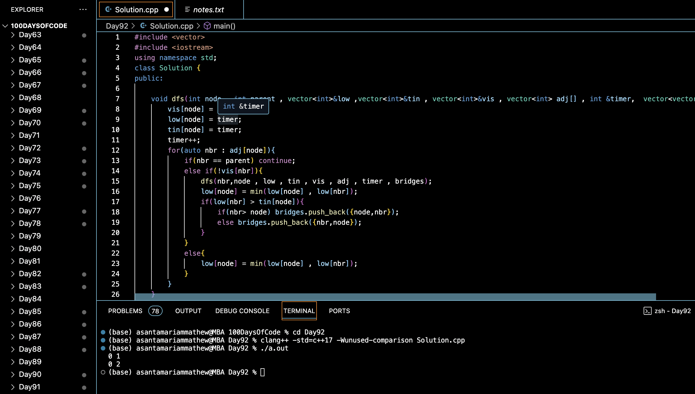

# FIND ALL CRITICAL CONNECTIONS IN THE GRAPH :blush:
## DAY :nine: :two: -February 14, 2024

## Code Overview

This C++ code implements a solution to find critical connections (bridges) in an undirected graph using Tarjan's algorithm.

## Key Features

- **DFS Function**:
  - Defines a depth-first search (DFS) function (`dfs`) to find bridges in the graph.
  - Uses Tarjan's algorithm to identify critical connections.
  - Keeps track of discovery time (`tin`) and lowest reachable ancestor (`low`) for each node.
  - Identifies bridges when a child node has a lower discovery time than its parent.

- **Critical Connections Function**:
  - Implements a function (`criticalConnections`) to find critical connections in the graph.
  - Initializes vectors to store low, tin, and visited status for each node.
  - Invokes the DFS function to traverse the graph and identify bridges.
  - Sorts the identified bridges for consistent output.

## Code Breakdown

- **`dfs` Function**:
  - Takes the current node (`node`), its parent (`parent`), low and tin vectors, visited vector, adjacency list (`adj`), timer, and bridges vector as arguments.
  - Performs depth-first search traversal to identify critical connections.
  - Updates low and tin values for each node and identifies bridges when applicable.

- **`criticalConnections` Function**:
  - Takes the number of vertices (`v`) and the adjacency list (`adj`) as arguments.
  - Initializes vectors to store low, tin, and visited status for each node.
  - Invokes the DFS function to traverse the graph and identify bridges.
  - Sorts the identified bridges for consistent output.

- **Main Function**:
  - Creates a sample undirected graph with multiple vertices and edges.
  - Calls the `criticalConnections` function to find critical connections in the graph.
  - Prints the identified bridges to the console.

## Usage

1. Compile the C++ code.
2. Run the compiled program.
3. The program will find and print the critical connections (bridges) in the input graph.

## Output

## Link
<https://auth.geeksforgeeks.org/user/asantamarptz2>
