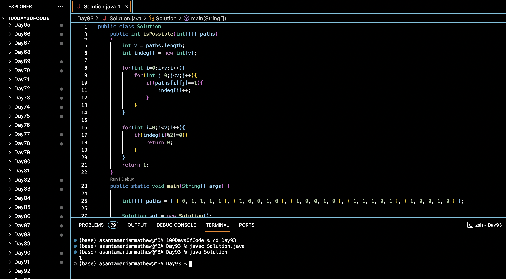

# TRAVERSE ALL EDGES AND VERTICES :blush:
## DAY :nine: :three: -February 15, 2024

## Code Overview

This Java code determines whether it is possible to construct a closed path (cycle) in a graph based on the provided adjacency matrix.

## Key Features

- **isPossible Method**:
  - Determines whether it is possible to form a closed path in the graph.
  - Counts the in-degree of each vertex by traversing the adjacency matrix.
  - Returns 1 if all vertices have even in-degrees (indicating the possibility of a closed path), otherwise returns 0.

- **Main Method**:
  - Constructs a sample adjacency matrix representing a graph.
  - Calls the `isPossible` method to check if a closed path can be formed.
  - Prints the result to the console.

## Code Breakdown

- **isPossible Method**:
  - Initializes an array `indeg` to store the in-degree of each vertex.
  - Traverses the adjacency matrix `paths` and counts the number of outgoing edges for each vertex.
  - Returns 0 if any vertex has an odd in-degree, indicating that it's not possible to form a closed path.
  - Otherwise, returns 1.

- **Main Method**:
  - Creates a sample adjacency matrix `paths` representing the graph structure.
  - Calls the `isPossible` method to check if a closed path can be formed in the graph.
  - Prints the result to the console.

## Usage

1. Compile the Java code.
2. Run the compiled program.
3. The program will output `1` if it's possible to form a closed path in the graph, and `0` otherwise.

## Output

## Link
<https://auth.geeksforgeeks.org/user/asantamarptz2>
