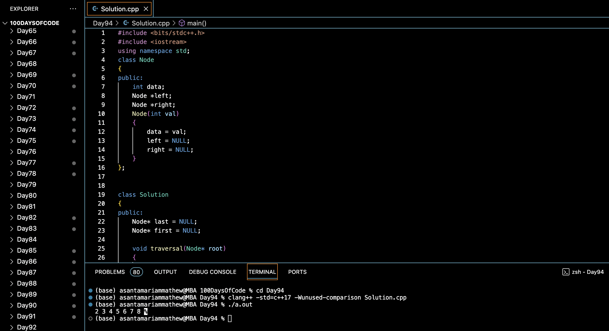

# FLATTEN BST TO SORTED LIST :blush:
## DAY :nine: :four: -February 16, 2024

## Code Overview

This C++ code flattens a binary search tree (BST) into a singly linked list by rearranging the pointers such that the list formed follows the in-order traversal of the BST.

## Key Features

- **Node Class**:
  - Represents a node in the BST with integer data.
  - Contains pointers to the left and right child nodes.

- **Solution Class**:
  - Implements the logic to flatten the BST.
  - Utilizes a traversal method to perform an in-order traversal of the BST and rearrange the pointers accordingly.
  - Maintains a `first` pointer to track the head of the flattened list and a `last` pointer to track the last node visited during traversal.

## Code Breakdown

- **traversal Method**:
  - Recursively performs an in-order traversal of the BST.
  - Rearranges the pointers to convert the BST into a singly linked list.
  - Updates the `first` and `last` pointers during traversal.

- **flattenBST Method**:
  - Initiates the process of flattening the BST by calling the traversal method.
  - Returns the head of the flattened list (`first` pointer).

- **Main Function**:
  - Constructs a sample BST with integer values.
  - Calls the `flattenBST` method to flatten the BST.
  - Prints the flattened list.

## Usage

1. Compile the C++ code.
2. Run the compiled program.
3. The program will output the flattened singly linked list.

## Output

## Link
<https://auth.geeksforgeeks.org/user/asantamarptz2>