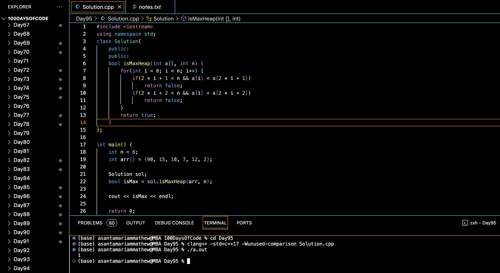

# DOES ARRAY REPRESENT HEAP :blush:
## DAY :nine: :five: -February 17, 2024

## Code Overview

This C++ program checks whether a given array represents a maximum heap or not.

## Key Features

- **Solution Class**:
  - Implements a method `isMaxHeap` to determine whether the given array represents a maximum heap.
  
## Code Breakdown

- **isMaxHeap Method**:
  - Iterates through each element in the array.
  - Checks whether the parent node is greater than its children nodes. If not, returns false.
  - If all elements satisfy the heap property, returns true.

- **Main Function**:
  - Initializes an array representing a heap.
  - Calls the `isMaxHeap` method to check if the array represents a maximum heap.
  - Prints the result.

## Usage

1. Compile the C++ code.
2. Run the compiled program.
3. The program will output `1` if the array represents a maximum heap, and `0` otherwise.

## Output

## Link
<https://auth.geeksforgeeks.org/user/asantamarptz2>
