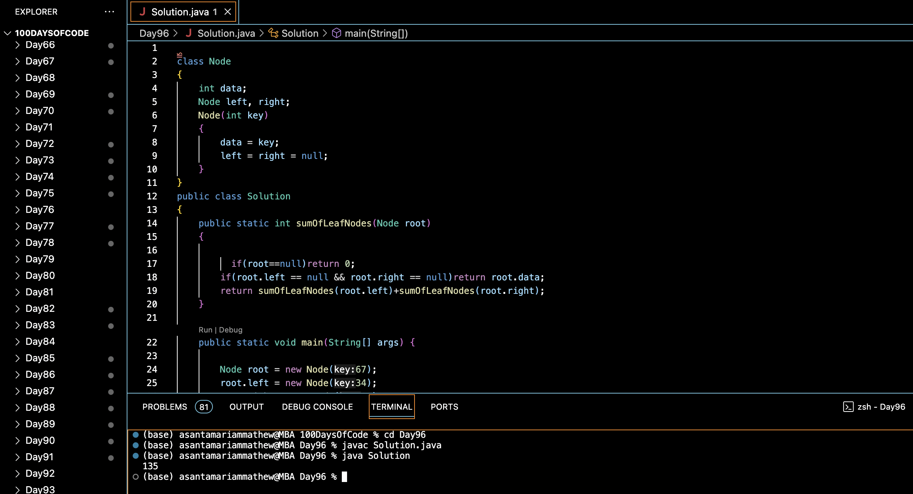

# SUM OF LEAF NODES IN BST :blush:
## DAY :nine: :six: -February 18, 2024

## Code Overview

This Java program calculates the sum of leaf nodes in a binary tree.

## Key Features

- **Node Class**:
  - Represents a node in the binary tree.
  - Contains data and references to left and right child nodes.

- **Solution Class**:
  - Implements a static method `sumOfLeafNodes` to calculate the sum of leaf nodes in the binary tree.

## Code Breakdown

- **sumOfLeafNodes Method**:
  - Recursively calculates the sum of leaf nodes in the binary tree.
  - Base cases:
    - If the root is null, returns 0.
    - If the root is a leaf node (both left and right children are null), returns the data of the leaf node.
  - Recursively calls `sumOfLeafNodes` on the left and right subtrees and adds their results.

- **Main Function**:
  - Initializes a binary tree with some nodes.
  - Calls the `sumOfLeafNodes` method to calculate the sum of leaf nodes.
  - Prints the result.

## Usage

1. Compile the Java code.
2. Run the compiled program.
3. The program will output the sum of leaf nodes in the binary tree.

## Output

## Link
<https://auth.geeksforgeeks.org/user/asantamarptz2>
