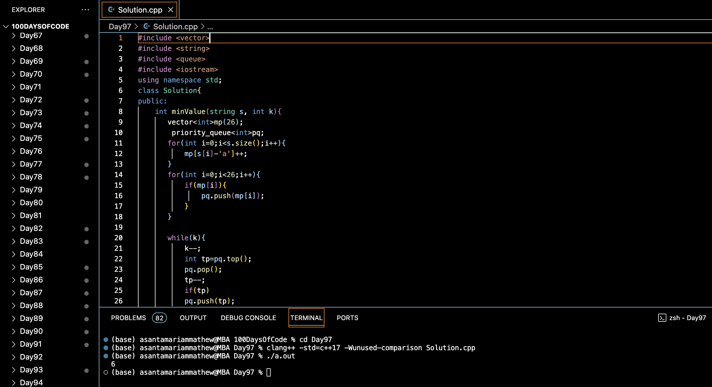

# GAME WITH STRING :blush:
## DAY :nine: :seven: -February 19, 2024

# Code Overview

This C++ program calculates the minimum value of the string `s` after performing `k` deletions of any character.

## Key Features

- **Solution Class**:
  - Contains a method `minValue` to calculate the minimum value of the string after performing deletions.
  - Uses a priority queue to keep track of the frequency of characters in the string.

## Code Breakdown

- **minValue Method**:
  - Initializes a frequency array `mp` to count the occurrences of each character in the string.
  - Inserts the frequencies into a max heap (priority queue) `pq`.
  - Performs `k` deletions by decrementing the top element of `pq` and reinserting it.
  - Calculates the minimum value by summing the squares of the remaining frequencies in `pq`.

- **Main Function**:
  - Creates an instance of the `Solution` class.
  - Initializes the string `s` and the integer `k`.
  - Calls the `minValue` method to calculate the minimum value after `k` deletions.
  - Prints the result.

## Usage

1. Compile the C++ code.
2. Run the compiled program.
3. The program will output the minimum value of the string after performing `k` deletions.

## Output

## Link
<https://auth.geeksforgeeks.org/user/asantamarptz2>
