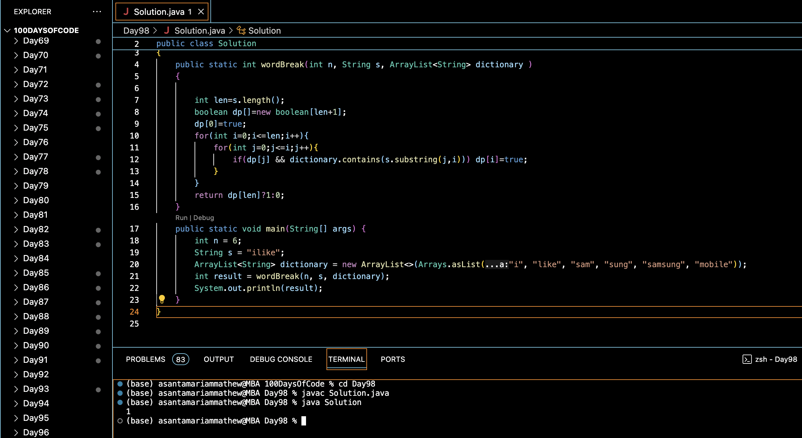

#  WORD BREAK :blush:
## DAY :nine: :eight: -February 20, 2024

## Code Overview

This Java program checks if a given string can be segmented into words from a dictionary.

## Key Features

- **Solution Class**:
  - Contains a method `wordBreak` to determine if the string can be segmented into words.
  - Uses dynamic programming to store whether substrings can be segmented.
  - Checks if substrings from the beginning of the string can be found in the dictionary.

## Code Breakdown

- **wordBreak Method**:
  - Initializes a boolean array `dp` to store whether substrings can be segmented.
  - Initializes the first element of `dp` as true.
  - Iterates through each character of the string and checks if substrings can be found in the dictionary.
  - Updates `dp` accordingly.
  - Returns 1 if the last element of `dp` is true, indicating that the entire string can be segmented.

- **Main Function**:
  - Creates an instance of the `Solution` class.
  - Initializes the string `s`, the dictionary, and the length of the string `n`.
  - Calls the `wordBreak` method to determine if the string can be segmented.
  - Prints the result.

## Usage

1. Compile the Java code.
2. Run the compiled program.
3. The program will output whether the given string can be segmented into words from the dictionary.

## Output

## Link
<https://auth.geeksforgeeks.org/user/asantamarptz2>
