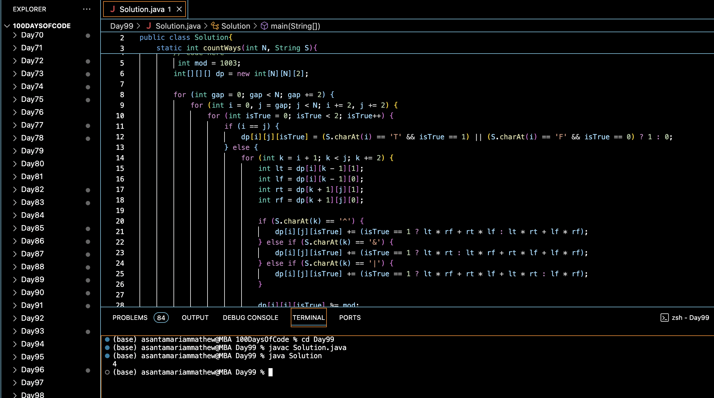

# BOOLEAN PARENTHESIZATION :blush:
## DAY :nine: :nine: -February 21, 2024

## Code Overview
This Java program evaluates the number of ways to parenthesize a given boolean expression to obtain a desired result. It uses dynamic programming to efficiently count the possible ways of parenthesizing the expression to yield a true result.

## Key Features
- Efficiently evaluates the number of ways to parenthesize a boolean expression.
- Handles boolean operators (^, &, |) and operands (T, F) in the expression.
- Utilizes dynamic programming with a 3D array to store intermediate results.

## Code Breakdown
The program consists of:
1. **`countWays` Method**: Calculates the number of ways to parenthesize the boolean expression.
    - Initializes a 3D array `dp` to store intermediate results.
    - Iterates through all possible subexpressions of the given boolean expression.
    - Utilizes dynamic programming to compute the number of ways to obtain a true result for each subexpression.
    - Handles different boolean operators (^, &, |) and operands (T, F) using appropriate logic.
    - Returns the total number of ways to parenthesize the expression to yield a true result.

2. **`main` Method**: The main entry point of the program.
    - Initializes the boolean expression `s` and its length `n`.
    - Calls the `countWays` method to compute the number of ways to parenthesize the expression and prints the result.

## Usage
To use this program:
1. Compile the Java file using a Java compiler.
2. Run the compiled program.
3. The program will output the number of ways to parenthesize the given boolean expression to obtain a true result.

## Output

## Link
<https://auth.geeksforgeeks.org/user/asantamarptz2>