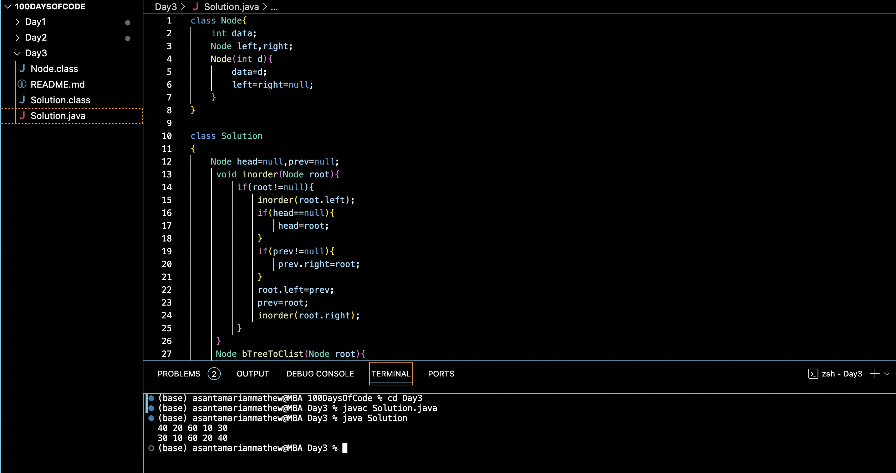

## BINARY TREE TO CDLL :blush:
## DAY :three: -November 17, 2023

## Code Overview
The code includes a Java implementation for converting a binary tree to a circular doubly linked list. It consists of two classes: Node representing a node in the binary tree or linked list, and Solution which contains the main logic for the conversion.

## Key Features
**Binary Tree to Circular Doubly Linked List Conversion**: The code efficiently converts a binary tree to a circular doubly linked list using the inorder traversal technique.

**Circular Doubly Linked List Construction**: It constructs a circular doubly linked list with the same elements as the binary tree but arranged in sorted order.

## Code Breakdown
**Node Class**: 

Defines a simple node structure with data, left, and right pointers.

**Solution Class**:

-inorder(Node root): Performs inorder traversal of the binary tree and constructs the circular doubly linked list.

-bTreeToClist(Node root): Initiates the conversion process by calling inorder() and returns the head of the circular doubly linked list.

-main(String[] args): Demonstrates the usage of the conversion method by creating a binary tree, converting it to a circular doubly linked list, and printing both forward and backward.

## Usage
1. Ensure you have a Java development environment set up.
2. Copy the Node and Solution classes into your project.
3. Create a binary tree by initializing nodes and setting their left and right pointers accordingly.
4. Instantiate the Solution class and call the bTreeToClist method with the root of the binary tree.
5. Traverse the circular doubly linked list using the returned head and perform necessary operations.

## Output

## Link
<https://auth.geeksforgeeks.org/user/asantamarptz2>

